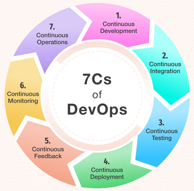

# Basics

## Table of contents
1. [What is DevOps?](#question1)
2. [What is CI/CD?](#question2)
3. [What are the different phases in DevOps?](#question3)
4. [Difference between continuous delivery and continuous deployment](#question4)
5. [Continuous testing process](#question5)
6. [Continuous Monitoring process](#question6)
7. [Difference between Horizontal and Vertical Scaling](#question7)
8. [Difference between DevOps & Agile](#question8)
9. [Configuration Management](#question9)
10. [Infrastructure as Code](#question10)
11. [Some](#question11)
12. [Some](#question12)
13. [Some](#question13)
14. [Some](#question14)
15. [Some](#question15)

## 1. What is DevOps? 
    **DevOps** is a set of practices, principles, and cultural philosophies that aim to unify software development (`Dev`) and IT operations (`Ops`). The goal of **DevOps** is to shorten the software development lifecycle, increase deployment frequency, and deliver high-quality software reliably.

    **Key aspects of DevOps:**
    - **Collaboration:** Encourages close collaboration between development, operations, and other stakeholders.
    - **Automation:** Automates repetitive tasks such as building, testing, and deploying software.
    - **Continuous Integration and Continuous Delivery (CI/CD):** Integrates code changes frequently and delivers them quickly and safely to production.
    - **Monitoring and Feedback:** Continuously monitors applications and infrastructure, using feedback to improve processes and products.
    - **Culture:** Fosters a culture of shared responsibility, transparency, and continuous improvement.

    DevOps helps organizations respond faster to customer needs, improve service reliability, and build better products through automation, collaboration, and iterative improvement.

## 2. What is CI/CD? 
    CI/CD, standing for Continuous Integration and Continuous Delivery/Deployment, is a core DevOps practice that automates the software development lifecycle, enabling faster, more frequent, and reliable software releases. Continuous Integration (CI) involves frequently merging code changes into a central repository, triggering automated builds and tests to catch issues early. Continuous Delivery (CD) automatically delivers these validated changes to a production-ready environment, while Continuous Deployment automatically releases them to end-users. 
    
    **Continuous Integration (CI)**
    - Frequent Code Merging:  
        Developers frequently commit code changes from their individual work into a shared source code repository. 
    - Automated Builds:  
        When new code is committed, an automated process builds the software. 
    - Automated Testing:  
        The integrated code is then automatically tested to identify defects and integration problems early in the process.  
    - Benefits:  
        This practice helps prevent integration conflicts, ensures code quality, and provides rapid feedback on code changes. 
    
    **Continuous Delivery (CD):**  
    - Automated Deployment to Staging:
        After successful integration and testing, code is automatically deployed to a production-like staging environment.
    - Manual Approval:
        The "delivery" stage typically ends here, requiring a manual approval from a human (e.g., operations or compliance team) before the code is released to production.
    - Benefits:
        This allows for rapid and reliable release readiness, but with an added layer of control. 

    **Continuous Deployment (CD)**  
    - Automatic Production Release:  
        When the code passes all automated tests and checks, it is automatically deployed directly to the production environment, making it available to customers.
    - Fully Automated Workflow:  
        This represents the most automated form of CD, further accelerating the delivery process.

## 3. What are the different phases in DevOps? 
    The phases in the DevOps lifecycle can be described in various ways, but they generally encompass an iterative loop of: Plan, Code, Build, Test, Release, Deploy, Operate, and Monitor, often referred to as the "seven Cs" or "seven stages" of Continuous Development, Integration, Testing, Delivery/Deployment, Monitoring, Feedback, and Operations. This continuous, collaborative process aims to automate and streamline the software delivery pipeline to achieve faster and more reliable software releases by integrating development and operations teams.  

    - Plan: Teams define project requirements, goals, and a strategy for the software. 
    - Code: Developers write and manage code, often using version control systems. 
    - Build: The code is compiled into deployable packages, a process often enhanced with Continuous Integration (CI). 
    - Test: Automated and manual testing is performed to ensure the code's quality and functionality. 
    - Release: Builds are approved and prepared for deployment to production environments. 
    - Deploy: The software is automatically deployed to production, a process that can involve Continuous Delivery (CD) or Continuous Deployment. 
    - Operate: The application is run and managed in the production environment. 
    - Monitor: Continuous monitoring collects data, logging, and feedback to identify and address issues, ensuring the application's performance and reliability. 

    These phases create an infinite loop, where feedback from the operate and monitor phases is used to inform future planning, leading to continuous improvement and rapid iteration. 

    

## 4. Difference between continuous delivery and continuous deployment 
    The main difference is that continuous delivery (CD) requires a manual approval to release a change to production, while continuous deployment automatically deploys every change that passes all testing stages directly to users without human intervention. Continuous delivery means your software is always ready to be released at any time, whereas continuous deployment actually releases it automatically

## 5. Continuous testing process 
    A continuous testing process involves automating and continuously executing tests throughout the entire software development lifecycle (SDLC), rather than just at the end, to provide rapid feedback and ensure software quality at every stage. By integrating automated tests with each code change and within the CI/CD pipeline, defects are found early when they are easiest and cheapest to fix, allowing for faster, more reliable, and higher-quality software releases. 

    - Integration with the SDLC:
        Testing is embedded into every phase of development, from initial code commits to deployment. 
    - Automated Execution:
        Automated tests, including unit, integration, system, and performance tests, are run automatically in response to code changes or pipeline triggers. 
    - Immediate Feedback:
        Developers receive instant feedback on their changes, allowing them to quickly identify and address issues. 
    - Early Defect Detection:
        By catching bugs early and often, the process reduces the cost and effort required to fix them. 
    - CI/CD Integration:
        Continuous testing is a crucial part of continuous integration and continuous delivery (CI/CD) pipelines, ensuring that the software remains in a releasable state. 

    Benefits:
    - Faster Delivery:
        Speeds up the software delivery pipeline by automating testing, leading to more frequent releases. 
    - Higher Quality:
        Ensures a high standard of quality by continuously validating code changes and preventing defects from reaching production. 
    - Reduced Costs:
        Finds and fixes bugs at the earliest possible stage, which is significantly less expensive than finding them later in the process. 
    - Improved DevOps Practices:
        Fosters collaboration between development and operations teams by integrating quality checks into the entire workflow. 
    - Greater Confidence:
        Provides increased confidence in software releases by rigorously testing the application at every stage

## 6. Continuous Monitoring process 
    A continuous monitoring process is an ongoing, systematic procedure using automated tools to constantly observe and collect data from IT systems, networks, and operational environments to detect, analyze, and respond to threats, vulnerabilities, performance issues, and compliance breaches in real-time or near-real-time. The process typically involves defining objectives, selecting and integrating tools, collecting data, analyzing it for anomalies, reporting on findings, and responding to identified issues to maintain security, optimize performance, and ensure compliance. 

    - Data Collection:
        Automated tools collect continuous data streams from various sources, including system logs, network traffic, application activities, and security event data. 
    - Data Analysis:
        Collected data is analyzed in real-time to identify patterns, anomalies, and deviations from normal behavior that could indicate a threat or issue. 
    - Reporting:
        Findings from the analysis are documented and reported, often through dashboards or alerts, providing actionable insights into the system's health and security posture. 
    - Response & Remediation:
        Teams respond to the identified issues, implementing corrective actions, mitigating risks, and addressing vulnerabilities to restore normal operations and enhance security. 

    Benefits:
    - Enhanced Security:
        Proactively identifies and responds to security threats and vulnerabilities before they cause harm. 
    - Improved Compliance:
        Helps an organization maintain regulatory compliance by ensuring continuous adherence to standards. 
    - Optimized Performance:
        Monitors system performance to identify and address bottlenecks and inefficiencies. 
    - Increased Operational Efficiency:
        Enables rapid detection of issues, facilitating quicker resolution and minimizing downtime. 

## 7. Difference between Horizontal and Vertical Scaling 
    Horizontal scaling (or scale-out) increases system capacity by adding more machines (nodes) to distribute workloads, while vertical scaling (or scale-up) increases capacity by upgrading existing hardware with more resources like CPU, RAM, or storage. Horizontal scaling creates redundancy and can theoretically offer unlimited capacity but requires load balancing, whereas vertical scaling is simpler but has physical and practical limits for a single machine. 

    - **Horizontal Scaling:** 
        **How To:** Add more servers or machines (nodes) to your system. 
        **Purpose:** To handle increased traffic and process more data by distributing tasks across multiple servers. 

        **Pros:**
        - Redundancy: Multiple machines provide fault tolerance, reducing the risk of a single point of failure. 
        - Scalability: Can achieve theoretically unlimited capacity by adding more nodes. 
        - Flexibility: Better suited for dynamic, growing environments and varying workloads. 
        **Cons:**
        - Complexity: Managing multiple machines and ensuring they work together can be more complex. 
        - Load Balancing: Requires sophisticated load balancing to distribute tasks efficiently. 

    - **Vertical Scaling:** 
        **How to:** Add more powerful hardware resources (like CPU, RAM, or storage) to a single existing server. 
        **Purpose:** To improve the performance of a single server by giving it more power to handle larger workloads. 

        **Pros:**
        - Simplicity: Easier to implement and manage, as operations remain on a single machine. 
        - Performance: Ideal for applications that cannot easily be split across multiple servers and require high processing power on a single machine. 
        **Cons:**
        - Limits: There is an upper limit to how much you can upgrade a single machine due to physical and practical constraints. 
        - Downtime: Upgrades often require taking the server offline, leading to downtime. 
        - Single Point of Failure: A failure in the single, upgraded server can lead to significant system failure. 

    When to Use:
    - Horizontal Scaling:
        Use for systems with unpredictable growth, fluctuating traffic, and the need for high availability, such as large-scale web applications or e-commerce platforms. 
    - Vertical Scaling:
        Use for resource-intensive, consistent workloads that perform well on a single, powerful machine, such as certain databases or video rendering services. 

## 8. Difference between DevOps & Agile 
    | Agile                                             | DevOps                                 |
    |---------------------------------------------------|----------------------------------------|
    | Agile is a method for creating software.          | It is not related to SW development.   |
    | An advancement and administration approach.       | Typically a conclusion of administration related to designing. |
    | The agile handle centers on consistent changes.   | DevOps centers on steady testing and conveyance.   |
    | Agile relates generally to the way advancement is carried out, any division of the company can be spry on its hones. This may be accomplished through preparation. | DevOps centers more on program arrangement choosing the foremost dependable and most secure course. |

## 9. Configuration Management 
    Configuration management is the automated and consistent management of software and infrastructure configurations throughout the application lifecycle, ensuring all elements are properly configured, synchronized, and tracked. It leverages tools like Ansible, Chef, Puppet, and Terraform for infrastructure and application configuration, utilizing version control (e.g., Git) and CI/CD pipelines to achieve reliable, repeatable, and agile software delivery. The goal is to reduce manual errors, maintain stability, improve collaboration, and accelerate the software delivery process

    Aspects:
    - Automation:
        Automates the deployment and configuration of applications and infrastructure, eliminating manual errors and increasing development velocity. 
    - Consistency:
        Ensures that all system configurations remain consistent across different environments (development, testing, production), leading to greater stability. 
    - Version Control:
        Integrates with version control systems like Git to track changes, manage versions, and facilitate collaboration, providing a single source of truth for configurations. 
    - Infrastructure as Code (IaC):
        Treats infrastructure and application configurations as code, enabling them to be versioned, tested, and deployed programmatically. 
    - Continuous Integration/Continuous Delivery (CI/CD):
        Forms a critical part of CI/CD pipelines, allowing for frequent and reliable software deployments. 
    - Configuration Tracking:
        Monitors and tracks changes to software and hardware configurations, maintaining control and visibility over complex environments.

    Benefits:
    - Increased Agility:
        Enables faster and more reliable software delivery by automating repetitive tasks and reducing complexity. 
    - Reduced Errors:
        Minimizes human error associated with manual configuration. 
    - Improved Collaboration:
        Provides a consistent, shared understanding of the system's state for development and operations teams. 
    - Enhanced Stability and Reliability:
        Reduces system failures and ensures environments remain in a desired, known state. 
    - Better Scalability:
        Makes it easier to add new servers and scale applications by quickly configuring them to a standardized state
    
    Tools:
    - Configuration Management Tools: Ansible, Chef, Puppet, SaltStack.
    - Infrastructure as Code Tools: Terraform, Bicep, Ansible
    - Version Control Systems: Git.
    - CI/CD Platforms: Zuul CI, AWS, Azure

## 10. Infrastructure as Code (IaC) 
    Infrastructure as Code (IaC) is a software development practice that uses code to provision and manage IT infrastructure like servers, networks, and databases, rather than manual processes or interactive tools. By treating infrastructure configurations as code, IaC enables version control, automation, consistency, and repeatability, allowing for quick, error-free deployments and management of infrastructure across different environments, much like managing application software.

    Principles:
    - Codification:
        Infrastructure resources and their configurations are defined in machine-readable files, such as YAML, JSON, or proprietary languages. 
    - Automation:
        IaC automates the setup, configuration, and management of infrastructure, reducing the need for manual intervention and human error. 
    - Version Control:
        IaC definitions are stored in version control systems like Git, providing a history of changes, enabling collaboration, and allowing for rollbacks to previous states. 
    - Consistency:
        By codifying configurations, IaC ensures that every deployment results in identical infrastructure setups, eliminating configuration drift and variability between environments (e.g., development, staging, and production). 
    - Repeatability:
        IaC makes it easy to deploy the same infrastructure configurations multiple times, creating reproducible environments for testing, development, and production.

    Benefits:
    - Speed and Efficiency:
        Automation drastically reduces the time and effort required to provision and update infrastructure. 
    - Reliability and Consistency:
        Eliminates manual errors and ensures that environments are identical, leading to more stable systems. 
    - Cost Savings:
        Automating resource management can optimize cloud usage, ensuring resources are used only when necessary. 
    - Improved Collaboration:
        Storing infrastructure as code in a shared repository facilitates peer review and knowledge sharing among teams. 
    - Disaster Recovery:
        The ability to quickly spin up and destroy infrastructure makes it easier and faster to recover from disasters.

