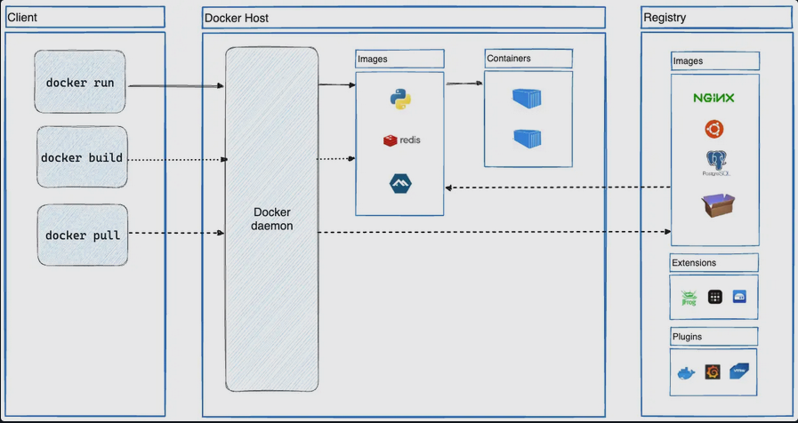

# Docker

## Table of contents
1. [What is Docker](#question1)
2. [Docker container](#question2)
3. [Architecture](#question3)
4. [Docker Images Optimization](#question4)
5. [Docker Compose](#question5)
6. [Docker Namespaces](#question6)
7. [Docker Container Lifecycle](#question7)
8. [Dockerfile](#question8)
9. [Docker containers vs images](#question9)
10. [Docker Volumes vs Bind Mounts](#question10)
11. [Docker Bridge Networking](#question11)
12. [Monitoring of Docker containers](#question12)
13. [Troubleshooting](#question13)
14. [Running and Managing Containers](#question14)
15. [Container Security](#question15)
16. [Docker Registry](#question16)

## 1. What is Docker <a name="question1"></a>

Docker is an open-source platform that simplifies the process of building, deploying, and running applications by using containerization. It packages software and all its dependencies (libraries, system tools, code, runtime) into standardized units called containers.

- Containers:
    These are lightweight, isolated environments that encapsulate an application and its entire runtime environment. Unlike traditional virtual machines, containers share the host operating system's kernel, making them more efficient and faster to start.
- Portability:
    Docker containers are designed to run consistently across different environments, whether it's a developer's local machine, a testing server, or a production cloud environment. This eliminates the "it works on my machine" problem.
- Efficiency:
    Due to their lightweight nature and shared kernel, containers consume fewer resources than virtual machines, allowing for higher application density on a given host.
- DevOps Enablement:
    Docker facilitates DevOps practices by providing a consistent and reproducible environment for development, testing, and deployment, significantly reducing the time from code creation to production.
- Ecosystem:
    Docker comes with a rich ecosystem of tools and services, including Docker Engine (the core runtime), Docker Hub (a repository for container images), and Docker Compose (for defining and running multi-container Docker applications).

## 2. Docker container <a name="question2"></a>

Docker container is a lightweight, standalone, and executable package of software that includes everything needed to run an application: code, runtime, system tools, libraries, and settings. It is a runnable instance of a Docker image. 

- Isolation:
    Containers run in isolated environments, preventing conflicts between applications and their dependencies, even when multiple containers run on the same host.
- Portability:
    Containers encapsulate all necessary components, allowing them to run consistently across various environments, including a developer's local machine, test servers, and production clouds.
- Lightweight:
    Unlike virtual machines, containers share the host operating system's kernel, eliminating the need for a separate guest OS for each application, which reduces resource consumption.
- Reproducibility:
    Docker containers ensure that applications behave consistently across different environments, as the container encapsulates the entire runtime environment.
- Manageability:
    Docker provides tools and commands to easily create, start, stop, move, and delete containers, facilitating application deployment and scaling.

Docker containers can be configured to restart automatically using restart policies. These policies determine how Docker should behave when a container stops, whether due to an error, a manual stop, or a Docker daemon restart.

## 3. Architecture <a name="question3"></a>

Docker utilizes a client-server architecture, enabling the building, running, and management of containers.  
  
Components:  
- Docker Daemon (dockerd):
    This is the background process running on the host machine. It listens for Docker API requests and manages Docker objects, such as images, containers, networks, and volumes. It performs the heavy lifting of containerization, including building images, starting and stopping containers, and handling network configurations.
- Docker Client (docker):
    This is the primary interface users interact with to send commands to the Docker Daemon. When a command like docker run is executed, the client translates it into an API request and sends it to the daemon. The client and daemon can run on the same system or communicate remotely.
- Docker Images:
    These are read-only templates containing the instructions and dependencies needed to create a Docker container. They are built in layers, with each layer representing a change or addition to the image.
- Docker Containers:
    These are isolated, runnable instances of a Docker image. They encapsulate an application and its dependencies, providing a consistent and portable environment for execution.
- Docker Registry:
    This is a centralized repository for storing and sharing Docker images. Docker Hub is a public registry, but private registries can also be used within organizations. 
- Communication Flow:
    The Docker Client communicates with the Docker Daemon via a REST API, typically over UNIX sockets on Linux or a network interface for remote connections. When a user issues a command through the client, the client sends an API request to the daemon, which then executes the requested operation (e.g., creating a container from an image, managing networks).



## 4. Docker Images Optimization <a name="question4"></a>

Docker image optimization focuses on reducing the size and improving the efficiency of container images. This leads to faster deployment times, reduced storage costs, enhanced security, and improved scalability. 
  
**Strategies :**  
- Choose Minimal Base Images:
    Start with lightweight base images like Alpine Linux or distroless images to minimize the initial footprint and unnecessary components.
- Leverage Multi-Stage Builds:
    Separate the build environment (with compilers, SDKs, etc.) from the final runtime environment. This ensures only essential artifacts are included in the final image, significantly reducing its size.
- Minimize the Number of Layers:
    Each instruction in a Dockerfile creates a new layer. Consolidate related commands into a single RUN instruction where possible to reduce the total number of layers and improve caching.
- Remove Unnecessary Files and Dependencies:
    During the build process, clean up temporary files, build artifacts, and unused dependencies that are not required in the final runtime image.
- Use `.dockerignore`:
    Exclude irrelevant files and directories from the build context using a .dockerignore file. This prevents unnecessary data from being copied into the image and improves build speed.
- Optimize Dockerfile Instructions:
    Arrange instructions to leverage Docker's build cache effectively. Place frequently changing instructions later in the Dockerfile to maximize cache hits for stable layers.
- Scan Images Regularly:
    Implement image scanning tools to identify and address vulnerabilities, further enhancing security and reducing potential attack surfaces.
- Compress Artifacts:
    If applicable, compress application artifacts or static assets before adding them to the image to further reduce size.

## 5. Docker Compose <a name="question5"></a>

Docker Compose is a tool for defining and running multi-container applications. It is the key to unlocking a streamlined and efficient development and deployment experience.  
  
Compose simplifies the control of your entire application stack, making it easy to manage services, networks, and volumes in a single YAML configuration file. Then, with a single command, you create and start all the services from your configuration file.  
  
Compose works in all environments - production, staging, development, testing, as well as CI workflows. It also has commands for managing the whole lifecycle of your application:
- Start, stop, and rebuild services
- View the status of running services
- Stream the log output of running services
- Run a one-off command on a service

```bash
docker compose up -d    # -d: detached
docker compose down
```
  
```YAML
version: '3.8' # Specify the Compose file format version

services:
  web:
    image: nginx:latest # Use the official Nginx image
    ports:
      - "80:80" # Map host port 80 to container port 80
    depends_on:
      - redis # Ensure Redis starts before Nginx
  redis:
    image: redis:latest # Use the official Redis image
    ports:
      - "6379:6379" # Map host port 6379 to container port 6379
```

## 6. Docker Namespaces <a name="question6"></a>

Docker leverages Linux kernel namespaces to provide the isolation essential for containers. Namespaces partition global system resources, making them appear as if they are dedicated to a specific set of processes within a container, thereby creating a virtualized environment.  
  
- PID Namespace (Process ID):
    Isolates the process tree, ensuring processes within a container have their own set of PIDs, independent of the host system's processes.
- Network Namespace:
    Provides a distinct network stack for each container, including its own network interfaces, IP addresses, routing tables, and firewall rules.
- Mount Namespace:
    Creates a separate filesystem hierarchy for the container, shielding it from the host's filesystem structure and allowing for isolated file operations.
- UTS Namespace (Unix Time-sharing System):
    Allows containers to have their own hostname and domain name, independent of the host system. 
- IPC Namespace (Inter-Process Communication):
    Isolates inter-process communication resources like shared memory, semaphores, and message queues, preventing interference between containers.
- User Namespace:
    Isolates user and group IDs, enabling secure mapping between container and host identities, enhancing security by allowing containers to run as a non-privileged user on the host while appearing as root within the container. (Note: User namespaces have been considered experimental in some Docker versions but are increasingly supported and used for enhanced security).
  
By utilizing these namespaces, Docker containers achieve a high degree of isolation, allowing multiple containers to run securely and efficiently on a single host system without interfering with each other or the host's operations.

## 7. Docker Container Lifecycle <a name="question7"></a>

The Docker container lifecycle describes the various stages a container goes through from its creation to its eventual removal. Understanding these stages is crucial for effective container management and troubleshooting.  
  
- Created:
    In this state, a container has been instantiated from a Docker image using the docker create command, but it is not yet running any processes. It exists as a defined entity, ready to be started.
- Running:
    When a container is started (e.g., using docker run or docker start), it enters the running state. In this state, the container executes the processes defined in its image and can interact with the host system, network, and other containers.
- Paused:
    A running container can be temporarily suspended using the docker pause command. In the paused state, the container's processes are frozen, but its state and resources are maintained. It can be resumed later using docker unpause.
- Stopped/Exited:
    A container enters the stopped or exited state when its main process completes or when it is explicitly stopped using the docker stop command. In this state, the container is no longer running, but its filesystem and configuration remain intact, allowing it to be restarted later.
- Removed/Dead:
    This is the final stage where a container is permanently deleted from the system using the docker rm command. Once removed, all associated resources and data are lost, and the container can no longer be started.

## 8. Dockerfile <a name="question8"></a>

A Dockerfile is a plain text file that contains a set of instructions used to build a Docker image. It serves as a blueprint or a recipe for creating a reproducible and consistent environment for an application within a Docker container.  
Each instruction in a Dockerfile represents a step in the image building process, creating a new layer in the final image.
  
- `FROM`: Specifies the base image upon which the new image will be built.
- `RUN`: Executes commands during the image build process, such as installing packages or configuring the environment.
- `COPY`: Copies files or directories from the host machine into the image.
- `WORKDIR`: Sets the working directory for subsequent instructions.
- `EXPOSE`: Informs Docker that the container listens on the specified network ports at runtime.
- `ENV`: Sets environment variables within the image.
- `CMD`: Defines the default command or program that will be executed when a container based on the image is started. 
  
Docker reads the Dockerfile, executes the instructions sequentially, and creates a layered image. This process ensures that the application and its dependencies are packaged together in a consistent manner, allowing for reliable deployment across different environments.  

## 9. Docker containers vs images <a name="question9"></a>

Docker images and containers are fundamental concepts in the Docker ecosystem, but they represent different stages in the application deployment process.  
1. Docker Image:
    - A Docker image is a read-only, immutable template that contains the application code, runtime, system tools, libraries, dependencies, and settings required to run an application.
    - It acts as a blueprint or snapshot of a complete software environment.
    - Images are built from a Dockerfile, which specifies the instructions for creating the image layers.
    - They are stored in registries (like Docker Hub) and can be easily shared and reused across different environments.
  
2. Docker Container:
    - A Docker container is a runnable instance of a Docker image.
    - It is a lightweight, isolated, and executable environment that encapsulates an application and its dependencies, ensuring consistent operation regardless of the underlying infrastructure.
    - When an image is run, a thin, writable layer is added on top of the image's read-only layers, allowing for changes within the container during its runtime.
    - Containers are dynamic and can be started, stopped, moved, or deleted during the application's lifecycle.

## 10. Docker Volumes vs Bind Mounts <a name="question10"></a>

Docker volumes and bind mounts are both mechanisms for persisting data in Docker containers, but they differ in their management and use cases.  
1. Docker Volumes:
    - Managed by Docker:
        Volumes are fully managed by Docker and stored in a specific directory within the Docker data directory on the host machine. Docker handles the creation, management, and deletion of volumes.
    - Independent of Host File System Structure:
        Volumes are independent of the host's directory structure and operating system, making them more portable across different Docker environments.
    - Recommended for Persistent Data:
        Volumes are the preferred method for persisting application data, such as databases or user-generated content, as they are not tied to the container's lifecycle and can be easily backed up and shared between containers.
    - Easier Management:
        Docker provides commands for managing volumes (e.g., docker volume create, docker volume ls, docker volume rm).
2. Bind Mounts:
    - Direct Access to Host File System:
        Bind mounts allow you to directly mount a specific file or directory from the host machine's file system into a container. This creates a direct link between the host and container file systems.
    - Host-Dependent:
        Bind mounts are dependent on the host's file system structure and are not as portable as volumes, as the host path must exist and be accessible.
    - Useful for Development and Specific Use Cases:
        Bind mounts are often used in development for quick access to source code or configuration files, allowing real-time changes on the host to be reflected in the container. They are also used for specific scenarios requiring access to host system resources (e.g., monitoring tools needing access to /proc or /sys).
    - Less Managed by Docker:
        Docker does not manage bind mounts in the same way it manages volumes; you are responsible for managing the host directories. 

## 11. Docker Bridge Networking <a name="question11"></a>

Docker Bridge Networking is a fundamental networking mode in Docker that enables communication between containers running on the same Docker host. It utilizes a software-based network bridge, similar to a virtual switch, to connect multiple containers and provide them with network connectivity. 
  
- Default Behavior:
    When a container is launched without specifying a network, it automatically connects to the default bridge network, named "bridge." 
- Container Communication:
    Containers connected to the same bridge network can communicate with each other using their assigned IP addresses or, within user-defined bridge networks, by their container names (due to Docker's built-in DNS resolution). 
- Isolation:
    Bridge networks provide isolation, meaning containers on one bridge network cannot directly communicate with containers on a different bridge network or external networks without explicit configuration (e.g., port mapping).
- External Access:
    Containers on a bridge network can access the internet through Network Address Translation (NAT) rules managed by Docker on the host machine.
- User-Defined Bridge Networks:
    Users can create custom bridge networks to logically group related containers and manage their network access more effectively. This allows for better organization and security than relying solely on the default bridge network.
- Single-Host Scope:
    Bridge networks are designed for communication between containers on a single Docker daemon host. For communication among containers running on different hosts, overlay networks or other advanced networking solutions are required.
  
Further reading: https://docs.docker.com/engine/network/drivers/bridge/

## 12. Monitoring of Docker containers <a name="question12"></a>

Monitoring Docker containers involves tracking their performance, health, and resource utilization to ensure the smooth operation of containerized applications. This practice is crucial for maintaining uptime, optimizing resource allocation, and quickly identifying and resolving issues.  
  
- Resource Utilization Monitoring:
    Tracking metrics such as CPU usage, memory usage, disk I/O, and network bandwidth consumed by individual containers and the host system. This helps identify resource bottlenecks and optimize resource allocation.
- Health Checks:
    Implementing health checks within containers to determine if the application inside is running as expected and responding to requests. Docker can automatically restart unhealthy containers.
- Logging and Log Analysis:
    Collecting and analyzing logs generated by containers and the Docker daemon to gain insights into application behavior, errors, and security events. Centralized log management tools are often used for this purpose.
- Network Monitoring:
    Observing network traffic and connectivity between containers, the host, and external services to ensure proper communication and identify network-related issues.
- Container State and Lifecycle Monitoring:
    Tracking the status of containers (running, stopped, paused), their creation and removal, and other lifecycle events.
- Orchestration System Integration:
    When using orchestration tools like Kubernetes or Docker Swarm, monitoring integrates with these systems to provide a holistic view of the entire containerized environment.
- Security Monitoring:
    Monitoring for security vulnerabilities, unauthorized access attempts, and suspicious activities within and around Docker containers.
- Custom Metrics and Alerts:
    Defining and tracking custom metrics specific to the application running in a container and setting up alerts for predefined thresholds to receive notifications about potential issues.
  
Tools and Techniques for Docker Monitoring:
1. Built-in Docker Commands:
    Commands like docker stats, docker ps, and docker inspect provide basic real-time information about running containers.
2. Specialized Monitoring Tools:
    Dedicated tools like Prometheus, Grafana, cAdvisor, Netdata, and commercial solutions (e.g., SolarWinds, New Relic, Datadog) offer comprehensive monitoring capabilities, including data collection, visualization, alerting, and integration with other systems.
3. Logging Solutions:
    Tools like ELK Stack (Elasticsearch, Logstash, Kibana), Splunk, or cloud-based logging services for centralized log collection and analysis.
4. Application Performance Monitoring (APM) Tools:
    APM solutions can monitor the performance of applications running inside Docker containers, providing insights into code-level performance and user experience.

## 13. Troubleshooting: How to debug issues within Docker containers <a name="question13"></a>

Debugging issues within Docker containers involves a systematic approach leveraging Docker's built-in tools and integrating with development environments.  
1. Inspect Container Logs:
    The first step is to examine the container's logs using `docker logs <container_name_or_id>`. This provides insights into application errors, startup issues, or other problems.
2. Access the Container Shell:
    For interactive debugging, use `docker exec -it <container_name_or_id> /bin/bash` (or /bin/sh if Bash is not available) to get a shell inside the running container. This allows you to inspect files, run commands, and test configurations directly within the container's environment.
3. Check Container Configuration and Resources:
    - Configuration:
        Verify the container's configuration using `docker inspect <container_name_or_id>` to ensure correct port mappings, environment variables, and volumes.
    - Resources:
        Use `docker stats <container_name_or_id>` to monitor CPU, memory, and network usage, identifying potential resource bottlenecks. 
4. Debug Networking Issues:
    - Connectivity:
        Use `docker exec -it <container_name_or_id> ping <target_host>` or `nc -zv <target_host> <port>` to test network connectivity from within the container.
    - Network Configuration:
        Use `docker network inspect <network_name_or_id>` to examine the Docker network setup and identify potential misconfigurations. 
5. Utilize Health Checks:
    Implement `HEALTHCHECK` instructions in your Dockerfile to automatically monitor the container's health and detect failures, allowing for quicker identification of issues.
6. Integrate with IDEs for Remote Debugging:
    Modern IDEs like Visual Studio Code offer extensions for Docker, enabling seamless remote debugging of applications running inside containers. This allows you to set breakpoints, step through code, and inspect variables as if the application were running locally.
7. Use Dedicated Debugging Tools (Development Environment):
    In development, consider mounting a volume with debugging tools and utilities into your container for easier troubleshooting. Remember to remove these tools for production environments to maintain container security and size optimization.

## 14. Running and Managing Containers <a name="question14"></a>

```bash
docker pull IMAGE_NAME[:TAG]
docker run -it --name my-app ubuntu /bin/bash   # interactive mode with name 'my-app'
docker run -d -p 80:80 nginx                    # detached mode with port mapping
docker run -d -v /data:/app/data my-app         # volume mount
docker ps -a                                    # list all containers
docker stop CONTAINER_NAME_OR_ID
docker start CONTAINER_NAME_OR_ID
docker restart CONTAINER_NAME_OR_ID
docker rm CONTAINER_NAME_OR_ID                  # -f in case of running container
docker logs CONTAINER_NAME_OR_ID                # -f to follow in real-time
docker inspect CONTAINER_NAME_OR_ID
docker exec -it CONTAINER_NAME_OR_ID /bin/bash  # execute smth on running container
```

## 15. Container Security <a name="question15"></a>

Docker Container Security encompasses a set of practices and tools aimed at protecting containerized applications and their underlying infrastructure from vulnerabilities and threats.   This involves securing various layers of the Docker ecosystem, including: 
1. Image Security:
    - Utilizing minimal, trusted base images from reputable sources.
    - Scanning images for Common Vulnerabilities and Exposures (CVEs) and known security flaws.
    - Avoiding the embedding of sensitive information (secrets) directly within Dockerfiles or container images.
    - Employing Docker Content Trust to verify the authenticity and integrity of images using digital signatures. 
2. Daemon and Host Security:
    - Hardening the Docker daemon by limiting or authenticating access to the docker.sock file.
    - Disabling TCP sockets for Docker communication or securing them with TLS encryption.
    - Regularly updating the host operating system to patch vulnerabilities.
    - Implementing and configuring firewalls to control network traffic to and from the host and containers.
    - Establishing strong user authentication and access controls for the host system. 
3. Runtime Security:
    - Running containers with non-root users to limit potential damage in case of a compromise.
    - Dropping unnecessary Linux capabilities to reduce the attack surface.
    - Enforcing read-only file systems for containers where appropriate.
    - Setting resource limits (CPU, memory) to prevent resource exhaustion attacks.
    - Implementing AppArmor, SELinux, or other hardening systems for enhanced isolation. 
4. Network Security:
    - Restricting container communication using custom networks or firewall rules.
    - Designing APIs and networks with security considerations, including proper segmentation and access control. 
5. Registry Security:
    - Utilizing secure container registries and implementing access controls to prevent unauthorized image uploads or downloads. 
6. Monitoring and Auditing:
    - Implementing continuous monitoring of container activity for suspicious behavior.
    - Logging and auditing security events for forensic analysis. 

## 16. Docker Registry <a name="question16"></a>

Docker Registry is a centralized system designed for the storage and distribution of Docker container images. It functions as a repository for managing and sharing these images, which are essentially lightweight, standalone, executable packages containing everything needed to run a piece of software, including the code, a runtime, system tools, libraries, and settings.
  
- Centralized Storage:
    It provides a central location to store all your Docker images, making them easily accessible for deployment across different environments.
- Version Control:
    Registries allow for the tagging and organization of images with different versions, facilitating image management and rollback capabilities.
- Image Distribution:
    They enable the efficient pulling and pushing of images, allowing developers and automated systems to easily access and deploy specific versions of applications.
- Public vs. Private:
    Registries can be public, like Docker Hub, which hosts a vast collection of official and user-contributed images, or private, which are often used within organizations to manage proprietary images securely.
- Open Source Implementation:
    The open-source implementation of a Docker Registry is known as "Distribution" and is maintained by the Cloud Native Computing Foundation (CNCF). This allows anyone to set up and run their own container image registry.