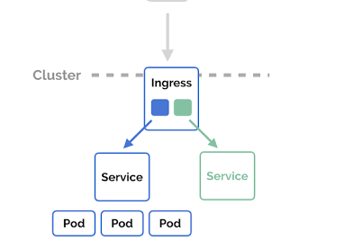

# Kubernetes

## Table of contents
1. [What is Kubernetes?](#question1)
2. [Core components of a Kubernetes cluster](#question2)
3. [Pod in Kubernetes](#question3)
4. [Kubernetes Services](#question4)
5. [Kubernetes Controller Manager](#question5)
6. [Namespaces in Kubernetes](#question6)
7. [Clusters in Kubernetes](#question7)
8. [Monitoring the Kubernetes cluster](#question8)
9. [Kubernetes Networking](#question9)
10. [Kubernetes Load Balancing](#question10)
11. [How Does Kubernetes Handle Secrets](#question11)
12. [Ingress in Kubernetes](#question12)
13. [Managing configuration changes in Kubernetes](#question13)
14. [Network Policies in Kubernetes](#question14)
15. [Security best practices in Kubernetes](#question15)
16. [Troubleshoot a Pod](#question16)
17. [CMDS](#question16)

## 1. What is Kubernetes? <a name="question1"></a>

Kubernetes, often abbreviated as K8s, is an open-source system designed for automating the deployment, scaling, and management of containerized applications. It provides a platform for orchestrating containers across a cluster of machines, ensuring high availability and efficient resource utilization. 
  
Orchestration: the automation of the coordination and management of multiple, disparate automated tasks and systems to create a single, cohesive workflow for software development and deployment. It goes beyond basic automation, which handles individual tasks, by orchestrating these tasks into a larger process, like a software delivery pipeline. The goal is to streamline complex workflows, improve the efficiency of individual automation tools, and enable faster, more reliable, and scalable software releases by ensuring all components work together seamlessly  
  
- Container Orchestration:
    It automates the deployment, scaling, and operational management of application containers.
- Service Discovery and Load Balancing:
    Kubernetes can automatically expose containers via DNS names or IP addresses and distribute network traffic among them to ensure stable performance.
- Storage Orchestration:
    It allows for the automatic mounting of various storage systems, providing persistent storage for containerized applications.
- Automated Rollouts and Rollbacks:
    Kubernetes facilitates rolling updates for applications with zero downtime and enables easy rollbacks to previous versions if issues arise.
- Self-Healing:
    It continuously monitors the health of containers and nodes, automatically restarting or rescheduling containers if failures occur.
- Resource Management:
    Kubernetes intelligently schedules containers based on defined resource requirements and constraints, optimizing infrastructure usage. 
- Portability:
    It is cloud-agnostic and can be deployed on-premise or across various cloud providers, promoting flexibility and avoiding vendor lock-in.

## 2. Core components of a Kubernetes cluster <a name="question2"></a>

A Kubernetes cluster is composed of a control plane (often referred to as the Master Node) and worker nodes, each with distinct but interconnected components.
  
1. Master Node Components (Control Plane):
    - API Server (kube-apiserver):
        This component exposes the Kubernetes API, serving as the front-end for the control plane. All communication with the cluster, whether from kubectl or other components, goes through the API Server.  
        **Further reading:** https://kubernetes.io/docs/reference/command-line-tools-reference/kube-apiserver/
    - etcd:
        A consistent and highly available key-value store that serves as Kubernetes' backing store for all cluster data, including configuration data, state information, and metadata.  
        **Further reading:** https://www.armosec.io/glossary/etcd-kubernetes/
    - Controller Manager (kube-controller-manager):
        This component runs various controller processes that regulate the cluster's state. Examples include the Node Controller (notices and responds when nodes go down), Replication Controller (maintains the correct number of pods), and Endpoints Controller (populates the Endpoints object).  
        **Further reading:** https://kubernetes.io/docs/reference/command-line-tools-reference/kube-controller-manager/
    - Scheduler (kube-scheduler):
        Watches for newly created Pods with no assigned node and selects a node for them to run on, considering factors like resource requirements, hardware/software/policy constraints, and affinity/anti-affinity specifications.  
        **Further reading:** https://kubernetes.io/docs/concepts/scheduling-eviction/kube-scheduler/
  
2. Worker Node Components:
    - Kubelet:
        An agent that runs on each worker node. It communicates with the API Server, ensuring that containers described in PodSpecs are running and healthy on its node.
        **Further reading:** https://kubernetes.io/docs/reference/command-line-tools-reference/kubelet/
    - Kube-proxy:
        A network proxy that runs on each worker node. It maintains network rules on the node, enabling network communication to your Pods from inside or outside of the cluster.  
        **Further reading:** https://kubernetes.io/docs/reference/command-line-tools-reference/kube-proxy/
    - Container Runtime:
        The software responsible for running containers. Common examples include Docker, containerd, and CRI-O. Kubelet interacts with the container runtime to pull images, start, and stop containers.  
        **Further reading:** https://kubernetes.io/docs/setup/production-environment/container-runtimes/

## 3. What is a pod in Kubernetes? <a name="question3"></a>

Pod is the smallest deployable unit that can be created and managed. It represents a single instance of a running process in a Kubernetes cluster.  
A Pod encapsulates one or more application containers (such as Docker containers), along with shared resources for those containers, including: 
- Shared Storage (Volumes):
    Pods can define volumes that can be accessed by all containers within the Pod, allowing for data sharing and persistence.
- Networking:
    Each Pod is assigned a unique cluster IP address, and containers within the same Pod share this network namespace, meaning they can communicate with each other using localhost.
- Information about how to run the containers:
    This includes details like the container image version, specific ports to use, and environment variables. 
  
While a Pod can contain multiple containers, the most common practice is to have a single container per Pod, with multi-container Pods typically used for tightly coupled "sidecar" containers that provide auxiliary functions to the main application container (e.g., a logging agent or a data feeder).  
  
Pods are ephemeral by nature. If a Pod fails or the node it is running on becomes unavailable, Kubernetes can automatically create a new replica of that Pod to maintain the desired state of the application. Pods are typically managed by higher-level abstractions like Deployments, StatefulSets, or Jobs, which handle their lifecycle, scaling, and self-healing capabilities.

## 4. Kubernetes Services <a name="question4"></a>

Kubernetes Services are an abstract way to expose an application running on a set of Pods as a network service. They provide a stable endpoint (IP address and DNS name) for accessing a group of Pods, even as individual Pods are created, destroyed, or rescheduled, ensuring uninterrupted access to the application. 
**Why Services are necessary:**  
- Pod Ephemerality:
    Pods are designed to be short-lived and can be replaced or rescheduled by Kubernetes. Services provide a stable abstraction over these dynamic Pods.
- Load Balancing and Discovery:
    Services enable load balancing of incoming traffic across multiple Pod replicas and provide a mechanism for other applications within the cluster to discover and connect to the exposed application.
  
Key **characteristics** of Kubernetes Services:
- Stable IP and DNS Name:
    A Service is assigned a stable ClusterIP (internal IP address) and a DNS name, which remain consistent throughout the Service's lifecycle.
- Selector-based Pod Grouping:
    Services use label selectors to identify the set of Pods they manage. Any Pod matching the specified labels becomes a member of the Service.
- Abstraction of Backend Details:
    Services abstract away the underlying Pod details, allowing clients to interact with the application without needing to know the individual Pod IP addresses.
  
**Common Service Types:**  
- ClusterIP:
    Exposes the Service on a cluster-internal IP. This type is suitable for internal communication within the cluster.
- NodePort:
    Exposes the Service on a static port on each Node's IP address. This allows external traffic to reach the Service through a specific port on any Node.
- LoadBalancer:
    Exposes the Service externally using a cloud provider's load balancer. This type automatically provisions an external load balancer with a public IP address.
- ExternalName:
    Maps the Service to a DNS name outside the cluster, useful for accessing external services like databases.

## 5. Kubernetes Controller Manager <a name="question5"></a>

The Kubernetes Controller Manager (also called kube-controller-manager) is a critical daemon that acts as a continuous control loop in a Kubernetes cluster. The controller monitors the current state of the cluster via calls made to the API Server, and changes the current state to match the desired state described in the cluster’s declarative configuration.  
  
The Controller Manager does not directly modify resources in the Kubernetes cluster. Instead, it manages multiple controllers responsible for specific activities—including replication controllers, endpoint controllers, namespace controllers, and service account controllers.  
  
**Key Responsibilities:**  
- Continuous Monitoring:
    kube-controller-manager constantly monitors the cluster’s state through the Kubernetes API server. This includes tracking the current configuration of Pods, Deployments, Services, and other resources.
- State Reconciliation:
    By comparing the desired state (as defined in Kubernetes manifests) with the actual state, the controller manager identifies any discrepancies.
- Corrective Actions: 
    When deviations are detected, the appropriate controllers take action to rectify the situation and bring the cluster back to its desired state. This might involve scaling Pods, restarting failed containers, or recreating resources as needed.
  
**Embedded Controllers:**  
Several controllers are bundled within the kube-controller-manager, each responsible for a specific aspect of cluster management:  
- Replication Controller: 
    Ensures the desired number of Pod replicas are running for Deployments or ReplicaSets.
    Endpoints Controller: Maintains an Endpoints object for each Service, reflecting the current set of Pods that back that Service.
- Namespace Controller: 
    Creates and manages Kubernetes namespaces, providing a way to isolate resources.
- Service Account Controller: 
    Creates and manages Service Accounts used for Pod authentication and authorization.
- Node Controller: 
    Tracks the health and availability of Nodes in the cluster.
- Token Controller: 
    Responsible for issuing authentication tokens for service accounts.
- Lease Controller: 
    Enforces leasing mechanisms for certain resources to prevent conflicts and maintain coordination.
  
**Deployment and Management:**  
- Installation: 
    kube-controller-manager is typically installed as part of the Kubernetes control plane along with other components like the API server and etcd. You can manage its deployment using tools like kubeadm or through a Kubernetes distribution’s provided means.
- Logging and Monitoring: 
    kube-controller-manager logs its activity to the cluster’s logging system, allowing you to monitor its performance and identify potential issues.
  
**Considerations:**  
- Scalability: 
    In large clusters, you might consider running multiple instances of kube-controller-manager for better scalability.
- Custom Controllers: 
    Kubernetes allows you to develop custom controllers to manage resources specific to your needs.
- Advanced Configuration: 
    The command-line flags for kube-controller-manager offer a broad range of configuration options. Consult the official Kubernetes documentation for detailed descriptions of each flag and its impact.

## 6. Namespaces in Kubernetes <a name="question6"></a>

Namespaces in Kubernetes provide a mechanism to logically partition a single Kubernetes cluster into multiple virtual sub-clusters. This partitioning allows for the isolation and organization of resources, particularly useful in multi-tenant environments or when managing different applications or teams within the same cluster.  
  
- Resource Isolation:
    Namespaces provide a scope for resource names, meaning that resources within one namespace can have the same name as resources in another without conflict. This prevents name clashes and allows for independent management of resources.
- Logical Grouping:
    They enable the grouping of related resources, such as all components of a specific application (e.g., frontend, backend, database) or resources belonging to a particular team or environment (e.g., development, staging, production).
- Access Control and Policy Enforcement:
    Namespaces are fundamental for implementing Role-Based Access Control (RBAC). Permissions can be defined at the namespace level, allowing administrators to control who can access and modify resources within a specific namespace. Network policies can also be applied to namespaces to control communication between pods.
- Default Namespaces:
    Kubernetes automatically creates several namespaces upon cluster creation, including default (for general user workloads), kube-system (for Kubernetes system components), kube-public (for publicly accessible resources), and kube-node-lease (for node health tracking).
- Limitations:
    While namespaces isolate most resources, certain cluster-wide resources like Nodes, PersistentVolumes, and StorageClasses are not namespaced and are visible across all namespaces. Namespaces cannot be nested.
  
Further reading: https://kubernetes.io/docs/concepts/overview/working-with-objects/namespaces/

## 7. Clusters in Kubernetes <a name="question7"></a>

A Kubernetes cluster is a collection of interconnected nodes (physical or virtual machines) that work together to run and manage containerized applications. It acts as a single, unified system for orchestrating container workloads. 
  
**Components of a Kubernetes Cluster:**  
1. Control Plane (Master Node):
    This is the brain of the cluster, responsible for managing its state and coordinating operations. Key components of the control plane include:
    - kube-apiserver: 
        The central management entity that exposes the Kubernetes API.
    - etcd: 
        A distributed key-value store that stores the cluster's configuration data.
        kube-scheduler: Assigns new Pods to available worker nodes based on resource requirements and other policies.
    - kube-controller-manager: 
        Runs various controller processes that regulate the cluster's state (e.g., ReplicationController, NodeController).
    - cloud-controller-manager (optional): 
        Integrates with cloud provider APIs to manage cloud resources. 
2. Worker Nodes:
    These are the machines where containerized applications (packaged within Pods) actually run Each worker node contains:
    - kubelet: 
        An agent that communicates with the control plane, manages Pods, and ensures containers are running in a healthy state.
    - kube-proxy: 
        A network proxy that handles network communication for Pods, enabling services to be exposed and load-balanced.
    - Container Runtime: 
        Software responsible for running containers (e.g., containerd, CRI-O, Docker).
  
**Purpose of a Kubernetes Cluster:**  
- Automated Deployment and Management:
    Automates the deployment, scaling, and management of containerized applications.
- High Availability:
    Distributes workloads across multiple nodes, ensuring applications remain available even if a node fails. 
- Scalability:
    Allows for horizontal scaling by adding or removing worker nodes based on demand.
- Resource Management:
    Efficiently allocates resources (CPU, memory) to applications.
- Centralized Management:
    Provides a single interface for managing and monitoring applications and the cluster itself.
  
Further reading: https://kubernetes.io/docs/concepts/architecture/

## 8. Monitoring the Kubernetes cluster <a name="question8"></a>

Monitoring a Kubernetes cluster involves collecting, analyzing, and visualizing data from various components within the cluster to ensure its health, performance, and stability. This data includes metrics, logs, and events generated by nodes, pods, containers, and the Kubernetes control plane. 
  
- Cluster State Metrics:
    Tracking the overall health and availability of the cluster, including node status (readiness, resource utilization), pod availability, and resource limits.
- Resource Utilization:
    Monitoring CPU, memory, disk I/O, and network usage at both the node and pod levels to identify bottlenecks and optimize resource allocation.
- Application Performance:
    Tracking application-specific metrics such as request latency, error rates, and throughput to ensure optimal application performance.
- Logs and Events:
    Collecting and analyzing logs from containers, pods, and the Kubernetes control plane to identify errors, troubleshoot issues, and understand system behavior.
- Alerting:
    Setting up alerts to notify operators of critical events, resource thresholds being exceeded, or other anomalies that require immediate attention.
  
Common tools and approaches for Kubernetes monitoring:
- Prometheus and Grafana:
    Prometheus is a popular open-source monitoring system for collecting metrics, while Grafana is used for visualizing the collected data through dashboards.
- Kubernetes Metrics Server:
    Aggregates resource usage data from kubelets on each node, providing basic metrics for horizontal pod autoscaling and other features.
- Logging Solutions:
    Tools like Elasticsearch, Fluentd, and Kibana (EFK stack) or Loki and Promtail are used for centralized log collection, analysis, and visualization.
- Cloud-Native Monitoring Solutions:
    Various commercial and open-source tools offer comprehensive Kubernetes monitoring capabilities, often integrating with existing cloud platforms.
  
Effective Kubernetes monitoring provides critical insights into the cluster's operation, enabling proactive issue detection, performance optimization, and efficient resource management.

## 9. Kubernetes Networking <a name="question9"></a>

Kubernetes networking establishes the communication infrastructure for pods, services, and external access within a Kubernetes cluster. Its core principle is the "IP-per-Pod" model, where each pod receives its own unique, cluster-wide IP address, enabling direct communication between pods without Network Address Translation (NAT).  
  
- Pods and their Network Namespace:
    Containers within a pod share the same network namespace and IP address, allowing them to communicate freely on localhost.
- Container Network Interface (CNI):
    Kubernetes relies on CNI plugins (e.g., Calico, Flannel, Cilium) to implement the network model. These plugins configure network rules, allocate IP addresses to pods, and handle routing traffic between pods across different nodes.
- Services:
    Services provide a stable, abstract way to expose a set of pods as a network service. They offer a consistent IP address and DNS name, acting as a load balancer to distribute traffic among the underlying pods, even if those pods are ephemeral and their IPs change.
- Network Policies:
    Network Policies enable fine-grained control over network traffic flow between pods based on labels, IP addresses, and namespaces. They enforce security by defining which pods can communicate with each other.
- Ingress:
    Ingress provides external access to services within the cluster, typically for HTTP/HTTPS traffic. It acts as a layer 7 load balancer and can handle features like SSL termination and name-based virtual hosting.
- DNS:
    Kubernetes includes an internal DNS service that allows pods to resolve service names to their corresponding cluster IP addresses, facilitating communication within the cluster using human-readable names.

## 10. Kubernetes Load Balancing <a name="question10"></a>

Load balancing in Kubernetes is the process of efficiently distributing network traffic among multiple instances of an application (Pods) running within a cluster, ensuring high availability, scalability, and optimal resource utilization.  
  
**How Load Balancing Works in Kubernetes:**  
1. Service Abstraction:
    Kubernetes uses the concept of a "Service" to define a logical set of Pods and a policy by which to access them. Services provide a stable endpoint for applications, abstracting away the dynamic nature of Pods (which can be created, deleted, or moved).
2. Internal Load Balancing (ClusterIP):
    - A ClusterIP Service provides a stable internal IP address within the cluster.
    - Traffic directed to this ClusterIP is then distributed among the backing Pods by kube-proxy, which runs on each node and maintains network rules (e.g., using iptables or IPVS) to route traffic to the correct Pods.
    - This is primarily for inter-service communication within the cluster. 
3. External Load Balancing:
    - NodePort: 
        Exposes a Service on a static port on each Node's IP address. External traffic can access the Service via <NodeIP>:<NodePort>. This is a basic form of external access and requires external load balancing if multiple nodes are involved.
    - LoadBalancer: 
        This Service type is typically used in cloud environments. When a Service of type LoadBalancer is created, Kubernetes interacts with the underlying cloud provider (e.g., AWS, GCP, Azure) to provision an external cloud load balancer. This external load balancer then directs traffic to the Nodes, which in turn route it to the correct Pods.
    - Ingress: 
        Ingress provides a more sophisticated way to manage external access to Services, especially for HTTP/HTTPS traffic (Layer 7). An Ingress controller (e.g., NGINX Ingress Controller, AWS ALB Ingress Controller) acts as a reverse proxy, interpreting Ingress rules to route traffic to specific Services based on hostnames, paths, and other criteria. Ingress controllers can integrate with external load balancers or provide their own load balancing capabilities.
  
**Load Balancing Strategies:**  
- Round Robin: 
    Distributes requests sequentially to each backend Pod in a cyclical manner.
- Least Connections: 
    Directs traffic to the Pod with the fewest active connections.
- IP Hash: 
    Routes requests from the same client IP address to the same Pod.
  
**Benefits of Load Balancing in Kubernetes:**  
- High Availability:
    Distributes traffic to prevent a single point of failure and ensures continuous service availability.
- Scalability:
    Allows for easy scaling of applications by adding or removing Pods, with the load balancer automatically adapting to the changes.
- Optimized Resource Utilization:
    Evens out the workload across Pods, preventing any single Pod from becoming overloaded.
- Fault Tolerance:
    Detects unhealthy Pods and automatically routes traffic away from them, maintaining service availability.

## 11. How Does Kubernetes Handle Secrets <a name="question11"></a>

Kubernetes handles secrets by providing a Secret object, which is an API object designed to store sensitive information like passwords, API tokens, or TLS certificates. This mechanism allows applications to access sensitive data without hardcoding it directly into configuration files or container images.  

1. Creation and Storage:
    - Secrets are created as Secret objects within the Kubernetes API.
    - The data within secrets is typically base64-encoded, but it is not encrypted by default at rest within the underlying etcd datastore. Encryption at rest for etcd must be explicitly configured.
    - Secrets can be created from literal values, files, or by directly specifying stringData (which Kubernetes will then base64-encode).

2. Access and Consumption by Pods:  
    Pods can consume secrets in two primary ways:  
    - Volume Mounts: Secrets can be mounted as files within a Pod's filesystem, making the sensitive data available as files in a specified path.
    - Environment Variables: Individual keys from a secret can be exposed as environment variables within a Pod's containers.

3. Security Considerations:
    - Encryption at Rest: 
        While secrets are base64-encoded, they are not encrypted by default in etcd. To secure secrets at rest, encryption at rest for etcd should be enabled and configured, potentially using a Key Management Service (KMS) provider.
    - Role-Based Access Control (RBAC): 
        Kubernetes RBAC is crucial for controlling who can create, view, and modify Secret objects. Fine-grained permissions ensure that only authorized users and service accounts can access sensitive information. 
    - Ephemeral Nature in Memory: 
        When a Pod consumes a secret, the secret data is held in memory only as long as the Pod is running. Upon Pod termination, the secret data is removed from memory.
    - Immutable Secrets: 
        Secrets can be marked as immutable to prevent accidental or unauthorized modifications after creation, enhancing stability and security.

4. Integration with External Secret Management Tools:
    For advanced scenarios or centralized secret management across multiple clusters, Kubernetes can integrate with external secret management tools like HashiCorp Vault or cloud-specific secret stores (e.g., AWS Secrets Manager, Azure Key Vault) to dynamically inject secrets into Pods.

Further reading: https://kubernetes.io/docs/concepts/security/secrets-good-practices/

## 12. Ingress in Kubernetes <a name="question12"></a>

Ingress is an API object that manages external access to services within a cluster, typically providing HTTP and HTTPS routing. It acts as a single entry point for incoming traffic and defines rules for how that traffic should be routed to different services based on hostnames, paths, and other HTTP attributes. 
  
- External Access:
    Ingress allows external users to access services running inside your Kubernetes cluster, which are otherwise typically only accessible within the cluster's internal network.
- Traffic Routing:
    It provides rules to route incoming HTTP/HTTPS traffic to specific services and ports based on criteria like hostname (e.g., www.example.com), path (e.g., /api/v1/users), or a combination of both.
- Load Balancing:
    Ingress can be configured to perform load balancing across multiple pods backing a service, distributing traffic evenly to ensure high availability and performance.
- SSL/TLS Termination:
    It can handle SSL/TLS termination, meaning it decrypts incoming HTTPS traffic before forwarding it to the backend services, simplifying certificate management for individual services.
- Name-Based Virtual Hosting:
    Ingress supports name-based virtual hosting, allowing multiple domain names or subdomains to be served by different services within the same cluster using a single Ingress resource.
- Ingress Controller:
    An Ingress resource itself doesn't directly handle traffic. It requires an Ingress Controller to fulfill its definition. The Ingress Controller, often implemented by projects like NGINX Ingress Controller or cloud-provider-specific load balancers, watches for Ingress resources and configures the necessary routing and load balancing infrastructure.
  
Benefits of using Ingress:
- Centralized Traffic Management:
    Provides a single point of entry and management for external traffic, simplifying routing configurations.
- Resource Efficiency:
    Avoids the need to create a separate LoadBalancer Service for each external service, optimizing resource usage and potentially reducing costs.
- Flexibility:
    Offers fine-grained control over traffic routing rules, enabling advanced scenarios like content-based routing and path-based routing.
- SSL/TLS Management:
    Centralizes SSL/TLS certificate management, making it easier to secure applications.



Further reading: https://kubernetes.io/docs/concepts/services-networking/ingress/

## 13. Managing configuration changes in Kubernetes <a name="question13"></a>

Managing configuration changes in Kubernetes primarily involves using ConfigMaps and Secrets to externalize configuration data and sensitive information from application code. 
  
1. Declarative Management with YAML Manifests:
    - Configuration is defined in YAML files (e.g., configmap.yaml, secret.yaml).
    - These files are then applied to the cluster using kubectl apply -f <filename.yaml>.
    - This approach enables version control of configurations and facilitates consistent deployments across environments. 
2. Updating ConfigMaps and Secrets:
    - Direct Modification (for quick, small changes): kubectl edit configmap <configmap-name> or kubectl edit secret <secret-name> allows direct modification in the default editor.
    - Updating via Manifests (preferred for versioning and automation): Modify the YAML manifest file and then re-apply it using kubectl apply -f <filename.yaml>. 
3. Propagating Changes to Pods:
    - ConfigMaps mounted as volumes: 
        When a ConfigMap mounted as a volume is updated, the changes are not automatically reflected in running pods. To apply the changes, the associated pods must be restarted or a rolling update must be initiated for their Deployment.  
        ```bash
        kubectl rollout restart deployment <deployment-name>
        ```
    - ConfigMaps as environment variables: 
        Changes to ConfigMaps used as environment variables also require pod restarts to take effect.
    - Secrets: 
        Similar to ConfigMaps, changes to Secrets typically require pod restarts for the updates to be consumed by the application. 
  
**Best Practices:**  
- Version Control: 
    Store all configuration files in a version control system (e.g., Git) to track changes, enable rollbacks, and facilitate collaboration.
- Least Privilege: 
    Restrict access to ConfigMaps and Secrets using Kubernetes RBAC (Role-Based Access Control).
- Secret Encryption: 
    Encrypt Secrets at rest to enhance security.
- Secret Rotation: Implement regular rotation of Secrets to mitigate the impact of potential breaches.
- Automation Tools: 
    Utilize tools like Helm or Kubernetes Operators to automate the management of ConfigMaps and Secrets, reducing manual errors.
- Avoid Hard-coding: 
    Externalize configurations and sensitive data using ConfigMaps and Secrets instead of embedding them directly in application code or container images.
  
Further reading: https://kubernetes.io/docs/concepts/configuration/overview/

## 14. Network Policies in Kubernetes <a name="question14"></a>

Network Policies in Kubernetes are a mechanism for controlling network traffic flow at the IP address or port level within a Kubernetes cluster. They are crucial for defining rules for traffic flow between pods, and between pods and external entities, based on protocols like TCP, UDP, and SCTP. 
  
**Purpose:**
- Network Segmentation and Security:
    Network Policies enable fine-grained control over network traffic, allowing for network segmentation and enhanced security for applications running in the cluster.
- Traffic Control:
    They define how pods are allowed to communicate with each other and other network endpoints, specifying rules for both ingress (incoming) and egress (outgoing) traffic.
- Isolation of Workloads:
    Network Policies help isolate sensitive workloads and ensure that only authorized traffic is allowed within the cluster, limiting potential damage in case of a security breach.
  
**Key Concepts:** 
- Pod Selector: 
    This selects the group of pods to which the Network Policy applies.
- Ingress Rules: 
    These define the allowed incoming traffic to the selected pods.
- Egress Rules:
    These define the allowed outgoing traffic from the selected pods.
- Policy Types:
    Network Policies can be defined for ingress, egress, or both. 
  
**Implementation:**
Network Policies are implemented by a Container Network Interface (CNI) plugin, such as Calico, Cilium, or Weave Net, which must be installed and configured in the Kubernetes cluster. Without a CNI plugin that supports Network Policies, these policies will not be enforced.  
  
**Default Behavior:**  
By default, in a Kubernetes cluster without any Network Policies applied, all pods can communicate freely with each other and with external networks. However, once even a single Network Policy is applied to a pod, the model shifts to a "default-deny" state for that pod, meaning all traffic to or from that pod is blocked unless explicitly allowed by a Network Policy.  

Further reading: https://spacelift.io/blog/kubernetes-network-policy

## 15. Security best practices in Kubernetes <a name="question15"></a>

Kubernetes security best practices encompass a multi-layered approach to protect the cluster and its workloads from various threats.  
  
1. Access Control and Authentication:
    - Implement Role-Based Access Control (RBAC): 
        Define granular permissions for users and service accounts based on the principle of least privilege.
    - Integrate Multi-Factor Authentication (MFA): 
        Enhance security for API server access and other critical components.
    - Secure the Kubernetes API Server: 
        Disable anonymous access, restrict access to authorized entities, and encrypt communication using TLS.

2. Network Security:
    - Utilize Network Policies:
        Control traffic flow between pods, namespaces, and external services to enforce isolation and restrict unauthorized communication.
    - Encrypt Data in Transit:
        Implement TLS for all communications within the cluster and for ingress/egress traffic. 
    - Isolate Workloads with Namespaces:
        Use namespaces to logically separate applications and provide an additional layer of access control. 

3. Workload Security:
    - Harden Container Images:
        Use minimal base images, avoid unnecessary components, and remove package managers or shells if not required.
    - Continuously Scan for Vulnerabilities:
        Implement automated scanning of container images throughout the CI/CD pipeline and in production.
    - Enforce Pod Security Standards:
        Apply security contexts to pods and containers to define security-related settings like privilege levels and user IDs.
    - Manage Secrets Securely:
        Use external secret managers or Kubernetes Secrets with encryption at rest and in transit. Avoid hardcoding secrets and rotate them regularly.

4. Cluster and Node Security:
    - Harden Cluster Configurations: 
        Follow security benchmarks and recommendations for configuring Kubernetes components.
    - Secure etcd: 
        Protect the Kubernetes datastore with TLS, firewalls, and encryption.
    - Regularly Update and Patch: 
        Keep the Kubernetes cluster, nodes, and underlying operating systems up-to-date with security patches.

5. Monitoring and Auditing:
    - Enable Audit Logging:
        Capture detailed records of actions and events within the cluster for forensic analysis and incident response.
    - Aggregate Logs and Metrics:
        Centralize logging and monitoring to gain insights into application behavior and identify potential security issues.
    - Implement Intrusion Detection and Prevention Tools:
        Monitor network and system activities for malicious actions or policy violations. 

6. Data Protection:
    - Encrypt Data at Rest: 
        Encrypt sensitive data stored in persistent volumes and other storage solutions.
    - Establish Backup and Recovery Procedures: 
        Implement comprehensive plans for data backup and disaster recovery.

## 16. How do you troubleshoot a Pod that is in a Pending or CrashLoopBackOff state? <a name="question16"></a>

Troubleshooting a Kubernetes Pod in a Pending or CrashLoopBackOff state involves a systematic approach to identify and resolve the underlying issues.
  
1. Troubleshooting a Pod in Pending state:
    A Pod in Pending state indicates that it cannot be scheduled onto a node. This usually points to resource constraints or scheduling issues. Check Pod Events. 
    ```bash
    kubectl describe pod <pod-name> -n <namespace>
    ```
    Look for messages under the "Events" section, which often provide clues from the scheduler about why the pod cannot be placed (e.g., insufficient CPU, memory, or node selectors not matching).
      
    - Verify Resource Availability:
        - Cluster Resources: 
            Check if the cluster has enough available CPU, memory, or other resources to accommodate the pod's requests.
        - Node Resources: 
            Ensure that individual nodes have sufficient resources and are not oversubscribed.
        - Resource Requests and Limits: 
            Review the pod's resource requests and limits in its YAML definition to ensure they are realistic and not excessively high. 
    - Inspect Node Selectors and Taints/Tolerations:
        - If the pod uses nodeSelector or affinity rules, verify that there are nodes matching these criteria.
        - If nodes have taints, ensure the pod has the corresponding tolerations. 
    - Check Persistent Volume Claims (PVCs):
        - If the pod requires a PVC, ensure the PVC is bound to a Persistent Volume (PV) and that the PV is available and accessible.

2. Troubleshooting a Pod in CrashLoopBackOff state:
    A CrashLoopBackOff state means the container within the pod is repeatedly starting and crashing. This typically indicates an issue with the application or container configuration. Examine Pod Logs.
    ```bash
    kubectl logs <pod-name> -n <namespace>
    ```
    This command retrieves the logs from the crashing container, which often contain error messages or stack traces explaining the reason for the crash (e.g., unhandled exceptions, configuration errors, missing dependencies). If the pod has restarted, use `kubectl logs --previous <pod-name>` to view logs from the previous instance. describe the pod.
    ```bash
    kubectl describe pod <pod-name> -n <namespace>
    ```
    Look for "Events" related to liveness or readiness probe failures, OOMKilled messages (indicating out-of-memory issues), or other container-related events. Also, review the container's command and args to ensure they are correct.

    - Review Container Image and Configuration:
        - Image Validity: 
            Confirm the container image exists and is accessible from the cluster.
        - Environment Variables: 
            Verify that environment variables are correctly set and provide necessary values for the application.
        - Startup Commands/Entrypoint: 
            Ensure the command or entrypoint defined in the container's configuration is correct and executes the application as intended. 
    - Check Resource Limits:
        - If logs or events indicate OOMKilled, the container might be running out of memory. Adjust resource limits in the pod's YAML to provide sufficient resources. 
    - Inspect Liveness and Readiness Probes:
        If probes are configured, verify their settings (e.g., initialDelaySeconds, periodSeconds, timeoutSeconds) to ensure they are not causing premature restarts or failing due to application startup times. 
    - Analyze Application Code:
        If the issue persists, the problem might lie within the application code itself (e.g., unhandled exceptions, infinite loops, or resource leaks). Review the application's source code for potential bugs.

## 17. CMDS <a name="question17"></a>

1. Viewing and Inspecting Resources:
    - Lists resources of a specific type (e.g., `kubectl get pods`, `kubectl get deployments`, `kubectl get nodes`).
    ```bash
    kubectl get <resource_type>
    ```
    - Provides detailed information about a specific resource (e.g., kubectl describe pod my-pod).
    ```bash
    kubectl describe <resource_type> <resource_name>
    ```
    - Displays the logs of a specific pod
    ```bash
    kubectl logs <pod_name>
    ```

2. Creating and Modifying Resources:
    - `kubectl apply -f <filename.yaml>`: Creates or updates resources defined in a YAML or JSON file. This is the recommended way to manage resources declaratively.
    - `kubectl create -f <filename.yaml>`: Creates resources from a file.
    - `kubectl edit <resource_type> <resource_name>`: Opens the resource's configuration in your default editor for direct modification.

3. Managing Pods and Deployments:
    - `kubectl exec -it <pod_name> -- <command>`: Executes a command inside a running pod (e.g., `kubectl exec -it my-pod -- /bin/bash`).
    - `kubectl scale deployment/<deployment_name> --replicas=<number>`: Scales the number of replicas for a deployment.
    - `kubectl rollout status deployment/<deployment_name>`: Checks the status of a deployment rollout.

4. Deleting Resources:
    - `kubectl delete <resource_type> <resource_name>`: Deletes a specific resource (e.g., kubectl delete pod my-pod).
    - `kubectl delete -f <filename.yaml>`: Deletes resources defined in a YAML file. 

5. Cluster Information:
    - `kubectl cluster-info`: Displays information about the cluster master and services.
    - `kubectl config view`: Shows the current kubeconfig configuration