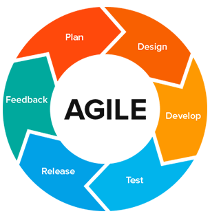
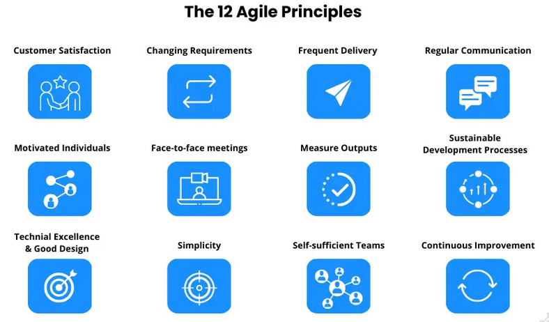

# Basics

## Table of contents
1. [What is Agile](#question1)
2. [What are the principles of Agile](#question2)
3. [What is Scrum](#question3)
4. [Difference between Scrum and Kanban](#question4)
5. [Core Agile events and artifacts](#question5)
6. [SOLID](#question6)
7. [Some](#question7)
8. [Some](#question8)
9. [Some](#question9)
10. [Some](#question10)

## 1. What is Agile 

Agile is a project management approach focused on incremental, iterative work and rapid response to change, emphasizing collaboration, flexibility, and continuous improvement over rigid plans and extensive documentation. Originating in software development with the Agile Manifesto in 2001, it breaks projects into small cycles (like sprints) to deliver value quickly, gather feedback, and adapt to evolving needs, allowing teams to thrive in uncertain environments.  
  
**Key Characteristics:**  
- Iterative and Incremental:  
    Projects are developed in short cycles, or iterations, where small, functional parts of the product are delivered.  
- Flexibility and Adaptability:  
    Agile approaches are designed to respond to change, allowing teams to pivot and adjust their plans as they go.  
- Collaboration:  
    Strong emphasis is placed on teamwork, communication, and close collaboration with customers and stakeholders. 
- Continuous Feedback:  
    Regular feedback loops are built into the process, enabling teams and stakeholders to provide input and make adjustments.  
- People-Centric:  
    It prioritizes individuals and interactions over strict processes and tools.  
  
**How it Works in Practice:**  
1. Small Sprints: A project is divided into small, manageable pieces of work completed in short development cycles, known as sprints.
2. Daily Stand-ups: Teams hold brief daily meetings to discuss progress, challenges, and plans for the day. 
3. Iteration and Review: At the end of each sprint, the team delivers a working increment of the product and reviews its performance in a retrospective meeting. 
4. Adaptation: Based on feedback and review, the team adapts the plan for the next sprint, ensuring the product continually evolves to meet changing requirements. 
  
**Benefits:**  
1. Faster Delivery: Incremental delivery means value is provided to the customer sooner. 
2. Increased Flexibility: Teams can adapt quickly to unexpected challenges or evolving project needs. 
3. Higher Customer Satisfaction: Continuous feedback and collaboration ensure the final product better meets customer needs. 
4. Improved Quality: Integrated quality checks and feedback cycles help catch and resolve issues earlier. 
  

## 2. What are the principles of Agile 

The principles of Agile are best understood through its founding documents, the Agile Manifesto and its 12 principles, which emphasize customer satisfaction through continuous delivery, collaboration, adapting to change, delivering working products frequently, and fostering self-organizing, motivated teams. These principles guide how Agile projects operate, focusing on iterative development, a sustainable pace, and continuous reflection and improvement to achieve desired outcomes effectively.  
  
**Core Values (from the Agile Manifesto):**  
- Individuals and interactions: over processes and tools
- Working software: over comprehensive documentation
- Customer collaboration: over contract negotiation
- Responding to change: over following a plan
  

## 3. What is Scrum 

Scrum is an Agile management framework for managing and developing complex products through self-organizing teams. It provides a lightweight structure of roles, events, and artifacts to help teams deliver value iteratively in short cycles called Sprints. Key components include the Product Owner, who prioritizes work; the Scrum Master, who fosters a supportive environment; and the Scrum Team, which collaborates to create a valuable Increment.  
  
**How Scrum Works:**  
1. Product Backlog:  
    The Product Owner maintains a list of all the work needed to create the product. 
2. Sprint Planning:  
    At the start of a Sprint (a fixed-length iteration, often two weeks), the team selects work from the Product Backlog to complete. 
3. Daily Scrum:  
    A short daily meeting where the team coordinates their work for the upcoming day. 
4. Sprint:  
    The team works to complete the selected work, creating a working Increment of the product by the end of the Sprint. 
5. Sprint Review:  
    The team demonstrates the Increment to stakeholders, and they provide feedback. 
6. Sprint Retrospective:  
    The team reflects on its work during the Sprint and identifies ways to improve its process for the next Sprint. 
  
**Key Principles and Values:**  
- Empirical Process Control:  
    Using experience and evidence rather than strict planning, with transparency, inspection, and adaptation. 
- Iterative and Incremental Delivery:  
    Delivering working parts of the product in small, repeating cycles to optimize control and predictability. 
- Continuous Improvement:  
    Encouraging teams to adapt and improve their processes and techniques over time. 
- Scrum Values:  
    A foundation of commitment, courage, focus, openness, and respect. 

## 4. Difference between Scrum and Kanban 

Scrum is an iterative framework that delivers value in time-boxed Sprints, requiring predefined roles and a Scrum Master, while Kanban is a flow-based method that focuses on visualizing workflow, limiting Work in Progress (WIP), and improving efficiency through continuous delivery. Key differences include Scrum's fixed iterations versus Kanban's continuous flow, Scrum's defined roles versus Kanban's flexibility, and Scrum's focus on Sprint goals versus Kanban's emphasis on overall workflow efficiency.  
  
| Aspect | Canban | Scrum |
|--------|--------|-------|
| Origins | Software development | Lean manufacturing |
| Roles and responsibilities | No predefined roles | Defined roles with Scrum Master and Product Owner |
| Delegation and prioritization | “Pull system” for individual task completion | “Pull system” with the entire batch pulled for each iteration |
| Due dates and delivery timelines | Continuous delivery on an as-needed basis | Sprint-based delivery with set periods for completion and review |
| Productivity measurement | Measures cycle time for project completion | Measures velocity through sprints and features iterative progress tracking |
| Modifications | Allows mid-stream project changes for continuous improvement | Changes are generally not encouraged during sprints |
| Key concepts | Effective and predictable | Transparent and adaptable |
| Best applications | Projects with widely varying priorities | Teams with relatively stable priorities that may not change significantly |

## 5. Core Agile events and artifacts 

The core Agile (Scrum) events are the Sprint, Sprint Planning, Daily Scrum, Sprint Review, and Sprint Retrospective, which provide a framework for regular interaction, inspection, and adaptation. The primary Agile artifacts are the Product Backlog, Sprint Backlog, and Increment, which provide transparency, communicate progress, and represent the work done  
  
1. **Sprint**: A consistent, fixed-length period (e.g., two to four weeks) during which the team creates a usable, valuable, and potentially shippable product Increment. 
2. **Sprint Planning**: The team collaborates to define the Sprint Goal and select the Product Backlog items that will be worked on during the Sprint, creating the Sprint Backlog. 
3. **Daily Scrum**: A short, daily meeting where the Scrum Team inspects progress toward the Sprint Goal and plans the work for the next 24 hours. 
4. **Sprint Review**: The team demonstrates the Increment to stakeholders, gathering feedback and adapting the Product Backlog for future Sprints. 
5. **Sprint Retrospective**: The team reflects on the past Sprint to identify what went well, what could be improved, and how to make those improvements in the next Sprint.

**Agile (Scrum) Artifacts:**  
These are information sources that provide transparency and outline the product being developed.  
- Product Backlog:  
    An ordered, dynamic list of all the features, requirements, and work needed for the product, prioritized by value and managed by the Product Owner. 
- Sprint Backlog:  
    A plan created by the Developers for the Sprint, outlining the work needed to achieve the Sprint Goal and updated in real-time. 
- Increment:  
    A usable and valuable piece of the product that is the result of a Sprint, representing the sum of all completed product backlog items during a Sprint

## 6. SOLID 

`SOLID` in programming refers to a set of five design principles intended to make software designs more understandable, flexible, and maintainable. These principles were introduced by Robert C. Martin (also known as Uncle Bob) and are widely adopted in object-oriented programming.  
  
The acronym SOLID stands for:
- `S`:  
    single Responsibility Principle (SRP): A class should have only one reason to change, meaning it should have only one responsibility.
- `O`:  
    Open/Closed Principle (OCP): Software entities (classes, modules, functions, etc.) should be open for extension but closed for modification. This means new functionality can be added without altering existing, working code.
- `L`:  
    Liskov Substitution Principle (LSP): Subtypes must be substitutable for their base types without altering the correctness of the program. This ensures that a derived class can be used in place of its parent class without causing unexpected behavior.
- `I`:  
    Interface Segregation Principle (ISP): Clients should not be forced to depend on interfaces they do not use. Instead of one large interface, create smaller, more specific interfaces.
- `D`:  
    Dependency Inversion Principle (DIP): High-level modules should not depend on low-level modules. Both should depend on abstractions. Abstractions should not depend on details; details should depend on abstractions. This promotes loose coupling and easier modification. 
  
By adhering to these principles, developers can create code that is more robust, scalable, and easier to manage over time.

## 7.  

## 8.  

## 9.  

## 10.  