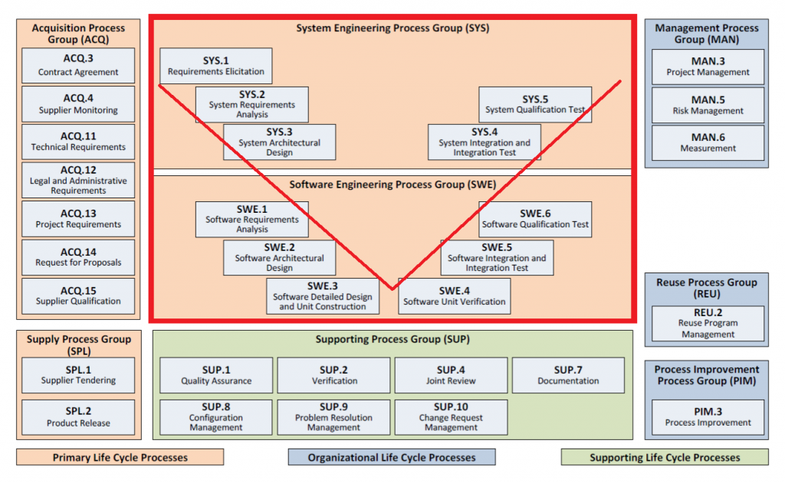
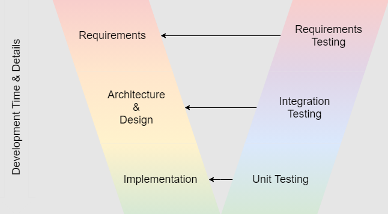

# ASPICE & AUTOSAR

## Table of contents
1. [What is ASPICE](#question1)
2. [Capability and Process Dimension](#question2)
3. [ASPICE SWE.3](#question3)
4. [ASPICE SWE.4](#question4)
5. [ASPICE SWE.5](#question5)
6. [V-Model](#question6)

## 1. What is ASPICE 

ASPICE (Automotive Software Process Improvement and Capability dEtermination) is a framework for the automotive industry that defines best practices for evaluating and improving software development and system engineering processes to ensure high quality, safety, and reliability in vehicles. It's based on the ISO 33000 standard (SPICE) and provides a structured approach for organizations to assess their process maturity and achieve higher capability levels, making it a vital tool for both automotive OEMs and suppliers.  
  
**ASPICE** stands for Automotive Software-based Process Improvement and Capability DEtermination.  
  
**Key Aspects of ASPICE**  
1. **Process-Oriented:**  
    It focuses on the processes used to develop software and systems, rather than just the final product. 
2. **Capability Levels:**  
    ASPICE defines six process capability levels, from Level 0 (Incomplete) to Level 5 (Innovating), to measure an organization's process maturity. 
3. **V-Model Foundation:**  
    The framework often follows a V-shaped model for development, emphasizing verification and validation at each stage. 
4. **Scope:**  
    It covers the entire software development lifecycle, including requirements engineering, design, implementation, integration, testing, configuration management, and project management. 
5. **Key Participants:**  
    Major European Original Equipment Manufacturers (OEMs) developed and use ASPICE to ensure their suppliers consistently deliver high-quality software. 
    
**Why is ASPICE Important?**  
1. **Improved Software Quality:**  
    It helps organizations identify and fix defects early in the development process. 
2. **Systematic Process Improvement:**  
    It provides a benchmark for continuous process improvement and enhances process maturity over time. 
3. **Supplier Evaluation:**  
    OEMs use ASPICE to evaluate their suppliers' capabilities and ensure they meet the necessary standards for software quality and safety. 
4. **Regulatory Compliance:**  
    Adherence to ASPICE standards helps organizations comply with industry regulations and requirements for automotive systems. 
5. **Enhanced Product Competitiveness:**  
    By ensuring high-quality and reliable products, ASPICE increases market competitiveness for automotive companies. 

## 2. Capability and Process Dimension 

**Capability dimension**  
- `Level 0`: **Incomplete**  
    - The process is not implemented, or the expected results are missing, incomplete, or unsuitable. 
    - Process activities are not carried out, or they are poorly executed. 
- `Level 1`: **Performed**  
    - The process is executed, and it delivers its intended purpose and work products. 
    - However, the process and its results are not controlled or documented. 
- `Level 2`: **Managed**  
    - Process activities are planned, monitored, and controlled at the project level. 
    - Responsibilities are clarified, and the results are systematically filed and quality assured. 
- `Level 3`: **Established**  
    - A standardized process is defined across the entire organization and followed by projects. 
    - The organization sets its own performance standards and continually learns from them. 
- `Level 4`: **Predictable**  
    - Processes are quantitatively measured, controlled, and stable within defined limits. 
    - Organizations use statistical indicators and historical data to reliably predict outcomes. 
- `Level 5`: **Innovating**  
    - This is the highest level of maturity, where processes are continually optimized based on quantitative feedback and causal analysis. 
    - Organizations proactively seek and implement process improvements to drive innovation and efficiency. 

**Process Dimension**  
Process Dimension defines the specific processes to be assessed, and the Capability Dimension, which measures the maturity or capability of an organization to perform those processes across six levels, from "incomplete" to "innovating". Together, these dimensions form a matrix that provides a comprehensive view of an organization's development process capabilities, enabling targeted improvements.  
  
Dimension lists the specific processes involved in the development lifecycle, grouped into categories like Engineering Processes (e.g., design, testing) and Support Processes (e.g., configuration management, quality assurance).  
  

## 3. ASPICE SWE.3 

**ASPICE SWE.3**, or "Software Detailed Design and Unit Construction," is a process in the Automotive SPICE framework focused on translating the software architectural design (SWE.2) into detailed blueprints for software components and then building these individual units. This process ensures a consistent structure for software creation by defining the detailed logic, interfaces, and dynamic behavior of software components, ultimately preparing them for unit verification (SWE.4).  
  
**SWE.3 Goals:**  
1. Translate architecture into design: Transform the high-level software architecture into a low-level, detailed design that specifies how each software unit will function.
2. Define software units: Detail the internal workings of individual software components, including their logic, data models, and interfaces.
3. Ensure consistency and integration: Establish clear interfaces between software units and ensure their consistent development to facilitate seamless integration later in the lifecycle.
  
**SWE.3 Activities and Artifacts:**  
1. Detailed Design Development:
    - Artifacts: Flowcharts, Class Diagrams, Component/Data Models, Interface Definitions. 
    - Description: This involves specifying the logic, data structures, and relationships within and between software units. 
2. Define Software Unit Interfaces:
    - Artifacts: Detailed interface definitions for each unit. 
    - Description: Crucial information for how units communicate, including parameters and contact points, is established. 
3. Describe Dynamic Behavior:
    - Artifacts: Class diagrams, State-flow diagrams, and diagrams showing relationships between units. 
    - Description: This outlines how software units interact and behave over time. 

## 4. ASPICE SWE.4 

**ASPICE SWE.4**, or Software Unit Verification, is a process within the Automotive SPICE framework that ensures individual software units function as specified in the Software Detailed Design (SWE.3) and meet requirements. It involves defining and performing verification activities like dynamic testing, such as back-to-back testing with a model, and static analysis to confirm correctness, freedom from runtime errors, and compliance with design specifications and coding standards. The goal is to find and fix bugs early, which improves software quality, reliability, and prevents issues from escalating.  
  
**SWE.4 Goals:**  
1. Bug Prevention: Catching defects at the unit level prevents them from becoming complex problems later in the development cycle. 
2. Quality Assurance: Ensures that individual software components are robust and perform reliably, building a strong foundation for the entire system. 
3. Efficiency: Addressing issues at the unit level is more cost-effective and time-saving than fixing major problems in integrated systems. 
4. Traceability: Verifying that the implemented code precisely matches the design specifications ensures that requirements are met. 
  
**SWE.4 Entails:**
1. **Verification Measures:** Defining and executing methods to confirm that software units behave as described in the detailed design. 
2. **Testing:** Conducting dynamic testing to find defects and ensure the unit's functionality matches its design. 
3. **Static Verification:** Using tools like static code analyzers to enforce coding standards and identify issues without executing the code. 
4. **Quality Verification:** Assessing software quality independently of the design, for example, ensuring it is free from runtime errors. 
5. **Regression Testing:** Establishing a strategy for re-testing after changes are made to the design or code. 

## 5. ASPICE SWE.5 

**ASPICE SWE.5**, or Software Integration and Integration Test, is a process in Automotive SPICE focused on verifying that the software components, as defined in the software architecture, are correctly integrated and interact as designed, ensuring their combined functionality. This involves creating a detailed integration test plan, designing test cases, executing these tests on the target hardware or simulated environment, and comparing the actual outputs against expected results to validate the integration and identify any issues.  
  
**SWE.5 Goals:**  
1. Functional Verification: To confirm that individual software components work together as a whole, fulfilling the software architecture's requirements and design. 
2. Interface Testing: To ensure that the interfaces between different software components are correctly implemented and function as specified. 
3. Early Detection of Issues: By testing the integrated system early, potential problems related to component interactions can be found and resolved before they impact later stages of development. 
  
**SWE.5 Activities:**  
1. Test Planning:  
    Creating a comprehensive test plan that outlines the integration strategy, test environment, test cases, and acceptance criteria. 
2. Test Case Design:  
    Developing test cases to cover various scenarios, including normal operations, abnormal conditions, and boundary values to ensure robustness. 
3. Test Execution:  
    Running the designed test cases on the actual target hardware or in a suitable simulated environment. 
4. Result Analysis:  
    Capturing the outputs from the tests and comparing them with the expected results to determine pass/fail status. 
5. Reporting and Validation:  
    Documenting the test results, reporting any deviations or defects, and validating that the integration meets the specified requirements. 

**What SWE.5 Verifies:**  
- Interaction between Components: It verifies how different software units or modules interact with each other.
- Correct Data Flow: It ensures that data flows correctly between integrated components.
- Functionality of the Integrated System: It confirms that the integrated software system performs its intended functions, as described by the software architecture.

## 6. V-Model 

The V-Model is a software and systems development lifecycle model that extends the Waterfall model by showing the parallel relationship between development phases and corresponding testing phases, visualized in a V-shape. The left side of the "V" details development activities like requirements analysis and design, while the right side corresponds to verification and validation activities such as unit testing, integration testing, and acceptance testing. This structure emphasizes early planning of testing to ensure comprehensive testing and quality throughout the project lifecycle.  
  

  
**Key Characteristics:**  
1. Sequential and Structured:  
    Like the Waterfall model, it follows a linear, phase-by-phase progression, with each phase needing completion before moving to the next. 
2. Emphasis on Testing:  
    It highlights the crucial role of testing by directly linking each development activity with a corresponding testing activity on the opposite side of the V. 
3. Clear Traceability:  
    The model provides clear connections, or traceability, between development work products and their associated test plans, making it easier to track requirements and design decisions. 
4. Verification and Validation:  
    It emphasizes validating the system against requirements and verifying that it is built correctly. 

**Phases and Testing Activities:**  
The V-model pairs development phases on the left with corresponding testing phases on the right:  
1. Requirements Analysis (Left): Focuses on defining system requirements.
2. Acceptance Testing (Right): Tests that the final system meets user needs and acceptance criteria.
3. System Design (Left): Creates high-level design specifications.
4. System Testing (Right): Tests the complete system.
5. High-Level Design (Left): Details the system architecture.
6. Integration Testing (Right): Tests the interaction between modules.
7. Low-Level Design (Left): Designs individual software modules.
8. Unit Testing (Right): Tests individual program components or modules.
9. Implementation (Bottom): The actual coding and development.

**Advantages:**  
- **Early Testing:** Testing is woven into the development process, helping to identify defects early.
- **Improved Quality:** Early and thorough testing contributes to a higher-quality product.
- **Regulatory Compliance:** Its structured and documented approach is well-suited for industries requiring strict adherence to regulations.
**Disadvantages:** 
- **Rigidity**: It can be inflexible, especially for complex projects where requirements may change during development.
- **Oversimplification:** It may not fully capture the complexities of modern, iterative, or Agile software development processes.
