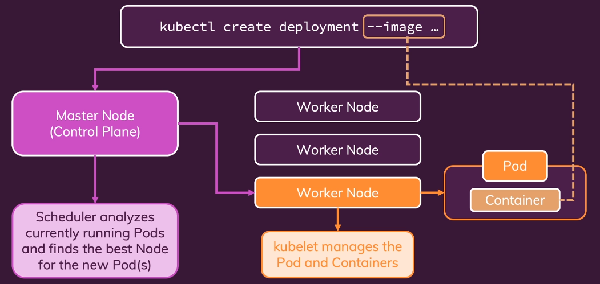
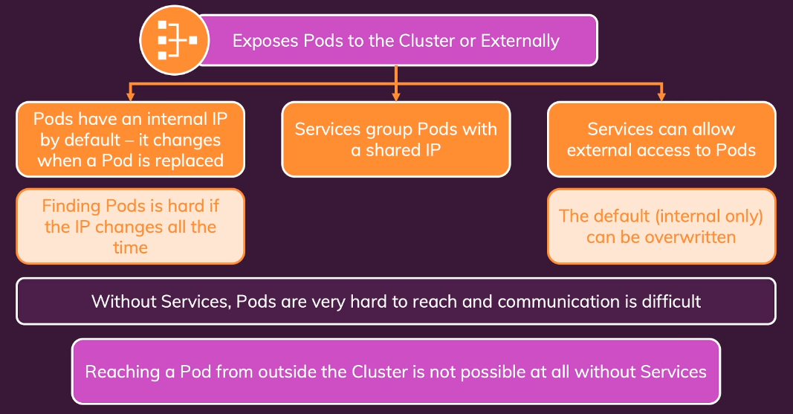

```
minikube start --driver=kvm
kubectl create deployment weather-app-k8s --image=abertowy/weather:1.1.0
kubectl get deployments
minikube addons enable metrics-server
minikube dashboard

kubectl expose deployment weatherapp --type=LoadBalancer --port=5000 
kubectl get services
minikube service weatherapp
|-----------|------------|-------------|----------------------------|
| NAMESPACE |    NAME    | TARGET PORT |            URL             |
|-----------|------------|-------------|----------------------------|
| default   | weatherapp |        5000 | http://192.168.39.65:31389 |
|-----------|------------|-------------|----------------------------|

```


  
