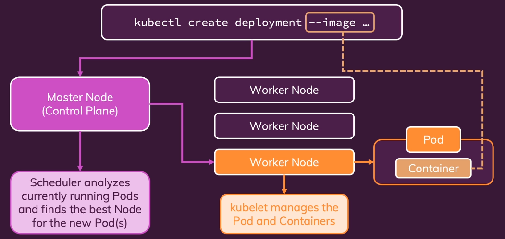
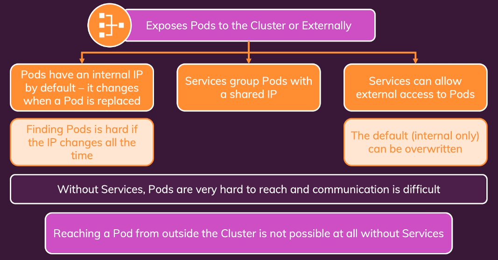

# Imperative vs declarative approach
  
While the declarative approach is generally recommended for production environments and complex systems, imperative commands remain valuable for quick interactions, testing, and generating manifest file templates.


1. Imperative approach
    This approach involves directly interacting with the Kubernetes API using kubectl commands to create, modify, or delete resources. It focuses on how to achieve a desired state through explicit, step-by-step instructions.  
  
    Characteristics:
        - Direct command execution (e.g., kubectl run, kubectl create, kubectl delete).
        - Immediate effect on the cluster.
        - Lacks version control and easy reproducibility for complex setups. 
  
    Use Cases:
        - Quick testing and experimentation.
        - Ad-hoc modifications for troubleshooting.
        - Learning and understanding basic Kubernetes operations.

    ```
    minikube start --driver=kvm
    kubectl create deployment weather-app-k8s --image=abertowy/weather:1.1.0
    kubectl get deployments
    minikube addons enable metrics-server
    minikube dashboard

    kubectl expose deployment weatherapp --type=LoadBalancer --port=5000 
    kubectl get services
    minikube service weatherapp
    |-----------|------------|-------------|----------------------------|
    | NAMESPACE |    NAME    | TARGET PORT |            URL             |
    |-----------|------------|-------------|----------------------------|
    | default   | weatherapp |        5000 | http://192.168.39.65:31389 |
    |-----------|------------|-------------|----------------------------|

    # restart pod automatically if it creashed
    kubectl scale deployment/weatherapp --replicas=3        # 3 pods are running now
    kubectl set image deployment/wetaherapp <pod name=weather in my case >=abertowy/weather:1.2.0
    kubectl rollout status deployment/wetaherapp            # old pod will not be shutdown if new pod didn't start successfully
    kubectl rollout undo dpeloyment/weatherapp              # reollback latest deployment
    kubectl rollout history deployment/weatherapp
    kubectl rollout undo dpeloyment/weatherapp --to-revision=1
    kubectl delete service weatherapp                       # service "weatherapp" deleted from default namespace
    kubectl delete deployment weatherapp                    # deployment.apps "weatherapp" deleted from default namespace

    ```

2. Declarative Approach:
    This approach defines the desired state of the cluster and its resources in manifest files, typically written in YAML or JSON. Kubernetes then works to reconcile the actual state with the declared state, ensuring consistency. It focuses on what the desired outcome should be.  
  
    Characteristics:
        - Resource definitions in manifest files (e.g., Deployment.yaml, Service.yaml).
        - Utilizes kubectl apply -f <manifest_file>.
        - Enables version control, reproducibility, and easier collaboration (e.g., via Git). 
  
    Use Cases:
        - Production deployments and managing complex applications.
        - Implementing GitOps workflows for infrastructure as code.
        - Ensuring consistency and auditability of changes.
  
    ```
    # create deployment.yaml
    kubectl apply -f=k8s_deployment.yaml
    kubectl apply -f=k8s_service.yaml
    kubectl get services
    minikube service weatherapp-service
    # re-apply in case of changes
    kubectl delete -f=k8s_deployment.yaml -f=k8s_service.yaml
    ```
      
    Multiple config files vs single: add separator `---` between parts in multiresoirce config file  

  
3. Differences and Considerations:
    - Reproducibility and Version Control:
        - **Declarative** excels here as configurations are stored in files, allowing for versioning and easy recreation of environments.
        - **Imperative** lacks this inherent capability.
    - Automation and CI/CD:
        - **Declarative** is highly suited for automation and integration into CI/CD pipelines due to its file-based nature.
    - Ease of Use for Simple Tasks:
        - **Imperative** can be quicker for one-off, simple tasks.
    - Complexity Management:
        - **Declarative** is better for managing complex application deployments and infrastructure, as it provides a clear, documented representation of the desired state.
  
  

  
