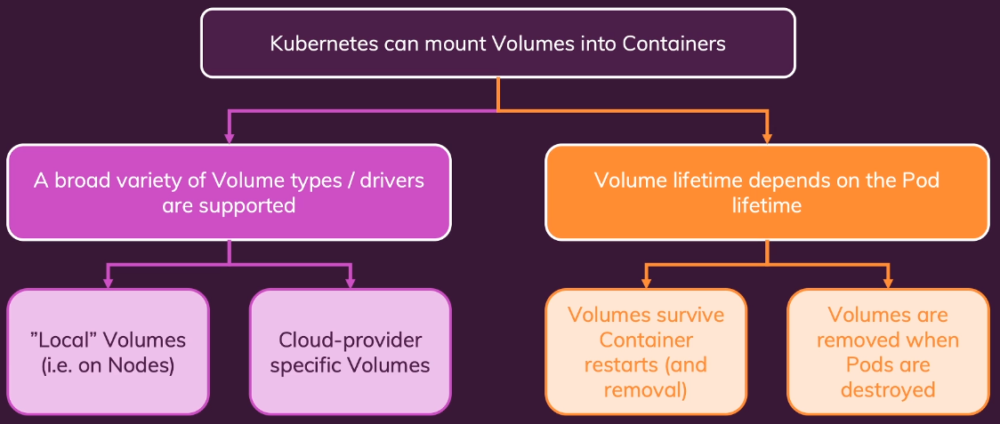
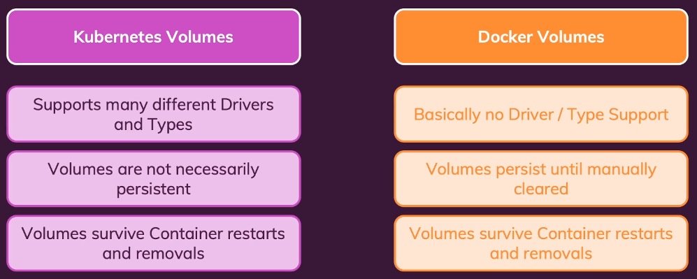

# K8s Volumes

1. Kubernetes volumes provide a mechanism for containers within a Pod to access and share data, and to ensure data persistence beyond the lifespan of individual containers. Unlike the ephemeral storage within a container, which is lost upon container restart or termination, data stored in a volume persists as long as the Pod exists.

2. Key Concepts:
    - Volume:  
        A directory containing data accessible by containers in a Pod. The type of volume determines its location, storage medium, and contents.
    - VolumeMounts:  
        Define how a declared volume is mounted within a specific container's filesystem, including the mount path. 

3. Types of Volumes:
    - Ephemeral Volumes:
        - emptyDir: A volume created when a Pod is assigned to a Node, initially empty, and deleted when the Pod is removed from the Node. Data is preserved across container restarts within the same Pod.
        - configMap, secret, downwardAPI: Volumes used to inject configuration data, sensitive information, or Pod metadata into containers.
        - CSI ephemeral volumes: Provided by Container Storage Interface (CSI) drivers that support ephemeral volume provisioning. 
    - Persistent Volumes (PVs):
        - Represent a piece of storage provisioned in the cluster, independent of any specific Pod.
        Have a lifecycle independent of the Pods that use them, ensuring data persistence even after Pod termination.
        - Can be provisioned statically (by an administrator) or dynamically (by a StorageClass).
        - Persistent Volume Claims (PVCs): Requests for a PV by users, specifying desired storage characteristics (e.g., size, access modes). Kubernetes binds PVCs to available PVs.
        - StorageClasses: Define different classes of storage (e.g., fast SSDs, slower HDDs) and how they are dynamically provisioned.

4. Benefits:
    - Data Persistence:
        Enables stateful applications by ensuring data remains available even if Pods or containers restart or are rescheduled.
    - Data Sharing:
        Allows multiple containers within a single Pod to share data through a common volume.
    - Decoupling Storage from Pods:
        PVs and PVCs abstract the underlying storage details from applications, promoting portability and flexibility.

5. CSI Volume type
    The **Kubernetes Container Storage Interface** (`CSI`) is a standard for exposing arbitrary block and file storage systems to containerized workloads on Kubernetes and other Container Orchestration Systems (COs). While CSI itself is a standard, it enables the use of various CSI volume types within Kubernetes. 
  
    CSI-backed volumes in Kubernetes primarily manifest as:
    - **Persistent Volumes** (`PVs`) and **Persistent Volume Claims** (`PVCs`):
        This is the most common and robust way to use CSI.
        - **Dynamic Provisioning**: A StorageClass is configured to use a specific `CSI driver`. When a **PersistentVolumeClaim** requests storage from this StorageClass, the `CSI driver` **dynamically** provisions a **PersistentVolume** on the underlying storage system.
        - **Static Provisioning**: A **PersistentVolume** can be **manually** created and bound to a **PersistentVolumeClaim**, with the **PersistentVolume** referencing a `CSI driver` for its source.
    - **CSI Inline Volumes** (`Ephemeral Volumes`):
        These volumes are defined **directly** within the **Pod's specification** and follow the Pod's lifecycle. They are **created** when the Pod is scheduled and **destroyed** when the **Pod is terminated**. This is useful for **temporary** storage needs where data persistence beyond the Pod's lifetime is not required. 
  
    Key characteristics of CSI volume types in Kubernetes:
    - **Driver-Specific Implementation**:
        The actual storage functionality (provisioning, resizing, snapshots, etc.) is implemented by the **specific** `CSI driver` developed by the storage vendor.
    - **Support for Various Storage Systems**:
        `CSI` allows Kubernetes to integrate with a **wide range** of external storage solutions, including cloud block storage (e.g., `AWS EBS`, `Azure Disk`), network file systems (e.g., `NFS`), `SANs`, and proprietary storage arrays.
    - **Advanced Feature**s:
        `CSI` enables **features** like volume cloning, snapshots, and volume expansion, provided the underlying CSI driver supports them.

5. Storage class
A Kubernetes StorageClass is a Kubernetes resource that enables dynamic provisioning of persistent volumes (PVs) within a cluster. It acts as an abstraction layer, defining different types of storage available to applications and automating the process of allocating storage resources.

`kubectl get pv`

  
-----------------------------------------
  
