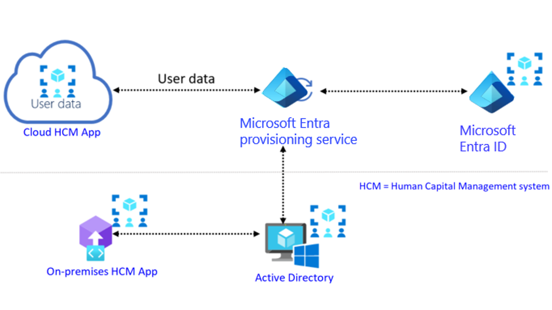

# AZ-104: Manage identities and governance in Azure

## Table of contents
1. [Microsoft Entra ID](#question1)
2. [Compare Microsoft Entra ID and Active Directory Domain Services](#question2)
3. [Microsoft Entra ID P1 and P2 plans](#question3)
4. [Microsoft Entra Domain Services](#question4)
5. [Create, configure, and manage users](#question5)
6. [Create, configure, and manage groups](#question6)
7. [Configure and manage device registration](#question7)
8. [Manage licenses](#question8)
9. [Migrate users with individual licenses to group licenses](#question9)
10. [Custom security attributes](#question10)
11. [System for Cross-Domain Identity Management (SCIM)](#question10)

## 1. Microsoft Entra ID 

**Active Directory Domain Services** (`AD DS` or `AD`) is a directory service that provides the methods for storing directory data, such as user accounts and passwords, and makes this data available to network users, administrators, and other devices and services. It runs as a service on Windows Server, referred to as a domain controller.  
**Microsoft Entra ID** is part of the **platform as a service** (`PaaS`) offering and operates as a Microsoft-managed directory service in the cloud. It’s **not a part of the core infrastructure** that customers own and manage, **nor** is it an **Infrastructure as a service** offering. While this implies that you have **less control** over its implementation, it also means that you **don’t have to dedicate resources to its deployment or maintenance**.  
  
**Microsoft Entra ID** extra features that aren’t natively available in AD DS:  
- support for multi-factor authentication
- identity protection
- self-service password reset

You can use **Microsoft Entra ID** to provide **more secure access** to cloud-based resources by:  
- Configuring access to applications
- Configuring single sign-on (`SSO`) to cloud-based `SaaS` applications
- Managing users and groups
- Provisioning users
- Enabling federation between organizations
- Providing an identity management solution
- Identifying irregular sign-in activity
- Configuring multi-factor authentication
- Extending existing on-premises **Active Directory** implementations to **Microsoft Entra ID**
- Configuring Application Proxy for cloud and local applications
- Configuring Conditional Access for users and devices

You automatically get Microsoft Entra ID with access to all the Free features if you have any subscription.  
By default, when you create a new Azure subscription by using a Microsoft account, the subscription automatically includes a new Microsoft Entra tenant named Default Directory.  

### Microsoft Entra tenants

**Microsoft Entra tenants** represents a company or organization that signed up for a subscription to a Microsoft cloud-based service. However, from a technical standpoint, the term tenant represents an individual Microsoft Entra instance. Within an Azure subscription, you can create multiple Microsoft Entra tenants.  
  
At any given time, an **Azure subscription must be associated with one, and only one, Microsoft Entra tenant**. This association allows you to grant permissions to resources in the Azure subscription (via RBAC) to users, groups, and applications that exist in that particular Microsoft Entra tenant.  
You can associate the **same Microsoft Entra tenant with multiple Azure subscriptions**. This allows you to use the same users, groups, and applications to manage resources across multiple Azure subscriptions.  
  
Each **Microsoft Entra tenant** is assigned the default Domain Name System (`DNS`) domain name, consisting of a **unique prefix**. Adding at least one **custom domain name** to the same Microsoft Entra tenant is **possible and common**.  

### Microsoft Entra schema

**Microsoft Entra schema** contains fewer object types than that of `AD DS`. Most notably, it doesn't include a definition of the computer class, although it does include the device class. The Microsoft Entra schema is easily extensible, and its extensions are fully reversible.  
You can't use Microsoft Entra ID to manage computers or user settings by using traditional management techniques, such as Group Policy Objects (GPOs).  
**Microsoft Entra ID**’s primary strength lies in:  
- providing directory services
- storing and publishing user, device, and application data
- handling the authentication and authorization of the users, devices, and applications

**Microsoft Entra ID** doesn't include the organizational unit (`OU`) class, which means that you **can't arrange** its objects into a **hierarchy** of custom containers, which is frequently used in on-premises AD DS deployments. You can accomplish equivalent arrangements by **organizing objects based on their group membership**.  

## 2. Compare Microsoft Entra ID and Active Directory Domain Services 

### Characteristics of AD DS

1. **AD DS** is a true directory service, with a hierarchical X.500-based structure.
2. **AD DS** uses Domain Name System (`DNS`) for locating resources such as domain controllers.
3. You can query and manage **AD DS** by using Lightweight Directory Access Protocol (`LDAP`) calls.
4. **AD DS** primarily uses the `Kerberos` protocol for authentication.
5. **AD DS** uses OUs and GPOs for management.
6. **AD DS** includes computer objects, representing computers that join an Active Directory domain.
7. **AD DS** uses trusts between domains for delegated management.

> [!NOTE] **X.500** is a set of international standards for directory services. A hierarchical **X.500**-based structure is a way of organizing data in a directory service in a tree-like, top-down fashion.  
  
> [!NOTE] Deploying AD DS on an Azure virtual machine requires one or more extra Azure data disks because you shouldn't use drive C for AD DS storage. These disks are needed to store the AD DS database, logs, and the sysvol folder. The Host Cache Preference setting for these disks must be set to `None`.  

### Microsoft Entra ID

1. **Microsoft Entra ID** is primarily an identity solution, and it’s designed for internet-based applications by using HTTP (port 80) and HTTPS (port 443) communications.
2. **Microsoft Entra ID** is a multi-tenant directory service.
3. **Microsoft Entra** users and groups are created in a flat structure, and there are no OUs or GPOs.
4. You **can't** query **Microsoft Entra ID** by using `LDAP`; instead, **Microsoft Entra ID** uses the REST API over HTTP and HTTPS.
5. **Microsoft Entra ID** doesn't use `Kerberos` authentication; instead, it uses HTTP and HTTPS protocols such as SAML, WS-Federation, and OpenID Connect for authentication, and uses OAuth for authorization.
6. **Microsoft Entra ID** includes federation services, and many third-party services such as Facebook are federated with and trust Microsoft Entra ID.

## 3. Microsoft Entra ID P1 and P2 plans 

The Microsoft Entra ID P1 or P2 tier provides extra functionality as compared to the Free and Office 365 editions.  

### Microsoft Entra ID P1 features

1. **Self-service group management**: it simplifies the administration of groups where users are given the rights to create and manage the groups. End users can create requests to join other groups, and group owners can approve requests and maintain their groups’ memberships.
2. **Advanced security reports and alerts**: you can monitor and protect access to your cloud applications by viewing detailed logs that show advanced anomalies and inconsistent access pattern reports. Advanced reports are **machine learning based** and can help you gain new insights to improve access security and respond to potential threats.
3. **Multi-factor authentication**: full multi-factor authentication (`MFA`) works with on-premises applications (using virtual private network [`VPN`], RADIUS, and others), Azure, Microsoft 365, Dynamics 365, and third-party Microsoft Entra gallery applications. It doesn't work with non-browser off-the-shelf apps, such as Microsoft Outlook.
4. **Microsoft Identity Manager (MIM) licensing**: **MIM** integrates with **Microsoft Entra ID P1** or **P2** to provide hybrid identity solutions. **MIM** can bridge multiple on-premises authentication stores such as **AD DS**, **LDAP**, **Oracle**, and other applications with **Microsoft Entra ID**. This provides consistent experiences to on-premises line-of-business (LOB) applications and SaaS solutions.
5. **Enterprise SLA of 99.9%**: you're guaranteed at least **99.9%** availability of the **Microsoft Entra ID P1** or **P2** service. **The same SLA applies to Microsoft Entra Basic**.
6. **Password reset with writeback**: self-service password reset follows the Active Directory on-premises password policy.
7. **Cloud App Discovery** feature of Microsoft Entra ID. This feature discovers the most frequently used cloud-based applications.
8. **Conditional Access based on device, group, or location**. This lets you configure conditional access for critical resources, based on several criteria.
9. **Microsoft Entra Connect Health**: you can use this tool to gain operational insight into **Microsoft Entra ID**. It works with alerts, performance counters, usage patterns, and configuration settings, and presents the collected information in the Microsoft Entra Connect Health portal.

### Microsoft Entra ID P2 features

1. **Microsoft Entra ID Protection**: this feature provides enhanced functionalities for monitoring and protecting user accounts. You can define user risk policies and sign-in policies. In addition, you can review users’ behavior and flag users for risk.
2. **Microsoft Entra Privileged Identity Management**: this functionality lets you configure additional security levels for privileged users such as administrators. With Privileged Identity Management, you define permanent and temporary administrators. You also define a policy workflow that activates whenever someone wants to use administrative privileges to perform some task.

## 4. Microsoft Entra Domain Services 

**Microsoft Entra Domain Services** (part of the **Microsoft Entra ID P1** or **P2** tier) provides domain services such as Group Policy management, domain joining, and Kerberos authentication to your **Microsoft Entra tenant**.  
These services are fully compatible with locally deployed AD DS, so you can use them without deploying and managing additional domain controllers in the cloud.  
Because Microsoft Entra ID can integrate with your local AD DS, when you implement Microsoft Entra Connect, users can utilize organizational credentials in both on-premises AD DS and in Microsoft Entra Domain Services.  

### Benefits:

1. Administrators don't need to manage, update, and monitor domain controllers.
2. Administrators don't need to deploy and manage Active Directory replication.
3. There’s no need to have Domain Admins or Enterprise Admins groups for domains that Microsoft Entra ID manages.

### Limitations

1. Only the base computer Active Directory object is supported.
2. It’s not possible to extend the schema for the Microsoft Entra Domain Services domain.
3. The organizational unit (OU) structure is flat and nested OUs aren't currently supported.
4. There’s a built-in Group Policy Object (GPO), and it exists for computer and user accounts.
5. It’s not possible to target OUs with built-in GPOs. Additionally, you can't use Windows Management Instrumentation filters or security-group filtering.

> [!NOTE] This service charges per hour based on the size of your directory.

## 5. Create, configure, and manage users 

**Microsoft Entra ID dashboard** in the Azure portal is used to work with user objects. You can only work with a **single directory** at a time. You can use the `Directory + Subscription` panel to switch directories.  
  
**Microsoft Entra ID defines users in three ways**:  
- **Cloud identities**: These users exist only in **Microsoft Entra ID**. Examples are administrator accounts and users that you manage yourself. Their source is **Microsoft Entra ID** or **External Microsoft Entra directory** if the user is defined in another Microsoft Entra instance but needs access to subscription resources controlled by this directory. When these accounts are removed from the primary directory, they're deleted.
- **Directory-synchronized identities**: These users exist in an on-premises **Active Directory**. A synchronization activity that occurs via **Microsoft Entra Connect** brings these users in to Azure. Their source is **Windows Server AD**.
- **Guest users**: These users exist outside Azure. Examples are accounts from other cloud providers and Microsoft accounts such as an Xbox LIVE account. Their source is **Invited user**. This type of account is useful when external vendors or contractors need access to your Azure resources. Once their help is no longer necessary, you can remove the account and all of their access.

After you delete a user, the account remains in a suspended state for 30 days. During that 30-day window, the user account can be restored, along with all its properties. After that 30-day window passes, the permanent deletion process is automatically started.  
**Required permissions to restore or permanently delete users**:  
- Global administrator
- Partner Tier-1 Support
- Partner Tier-2 Support
- User administrator

## 6. Create, configure, and manage groups 

A Microsoft Entra group helps organize users, which makes it easier to manage permissions.  

**Microsoft Entra ID allows you to define two different types of groups**:
- **Security groups** - the most common type of groups and are used to manage member and computer access to shared resources for a group of users. This option requires a Microsoft Entra administrator.
- **Microsoft 365 groups** - provide collaboration opportunities by giving members access to a shared mailbox, calendar, files, SharePoint site, and more. This option also lets you give people outside of your organization access to the group. This option is available to users as well as admins.

**Membership Type**:  
    This specifies how individuals members are added to the group.  
    - **Assigned** - members are added and maintained manually.
    - **Dynamic** - members are added based on rules, creating a Dynamic Group. These groups are still either a security group or Microsoft 365 group, just their members are controlled by rule.

## 7. Configure and manage device registration 

The goal of **Microsoft Entra registered devices** is to provide your users with support for the **BYOD** (bring-your-own-device) or mobile device scenarios. In these scenarios, a user can access your organization’s Microsoft Entra ID controlled resources using a personal device.  
**Operating systems**: Windows 10, Windows 11, iOS, Android, and macOS  
**Device sign in options**: End-user local credentials, Password, Windows Hello, PIN Biometrics  
**Device management**: Mobile Device Management (example: Microsoft Intune)  
**Key capabilities**: SSO to cloud resources, Conditional Access  
**Microsoft Entra registered devices** are signed in to using a **local account** like a Microsoft account on a Windows 10 device, but additionally have a **Microsoft Entra account** attached for access to organizational resources.  
  
**Microsoft Entra joined** is intended for organizations that want to be cloud-first or cloud-only.  
**Operating systems**: All Windows 10 & 11 devices except Windows 10/11 Home  
**Device management**: Mobile Device Management (example: Microsoft Intune)  
**Key capabilities**: SSO to both cloud and on-premises resources, Conditional Access, Self-service Password Reset and Windows Hello PIN reset  
**Microsoft Entra joined** devices are signed in to using an **organizational Microsoft Entra account**. 
  
If your environment has an on-premises AD footprint and you also want benefit from the capabilities provided by Microsoft Entra ID, you can implement **hybrid Microsoft Entra joined** devices. These devices are devices that are joined to your on-premises Active Directory and registered with your Microsoft Entra directory.  
**Use Microsoft Entra hybrid joined devices if:**
- You have Win32 apps deployed to these devices that rely on Active Directory machine authentication.
- You want to continue to use Group Policy to manage device configuration.
- You want to continue to use existing imaging solutions to deploy and configure devices.
- You must support down-level Windows 7 and 8.1 devices in addition to Windows 10.

### Device Writeback

In a cloud-based Microsoft Entra ID configuration, devices are only registered in Microsoft Entra ID. Your on-premises AD has no visibility of the devices. Device writeback helps you to keep a track of devices registered with Microsoft Entra ID in AD. You will have a copy of the device objects in the container "Registered Devices"  
**Scenario:**  
    You have an application that you want to give access to users only if they are coming from registered devices.  
**Cloud:**  
    You can write **Conditional Access** policies for any **Microsoft Entra** integrated applications to authorize based on whether the device is joined to **Microsoft Entra ID** or not.  
**On-premises:**  
    This is **not possible without device writeback**. If the application is integrated with ADFS (2012 or higher) then you can write claim rules to check for the device status and then provide access only if the `is managed` claim is present. In order to issue this claim, ADFS will check for the device object in the `Registered Devices` container and then issue the claim accordingly.  
  
**Windows Hello For Business** (WHFB) **requires device writeback** to function in Hybrid and Federated scenarios

## 8. Manage licenses 

**Licenses** could only be assigned at the individual user level, which can make large-scale management difficult. **Microsoft Entra ID** now includes **group-based licensing**. You can assign one or more product licenses to a group. Microsoft Entra ID ensures that the licenses are assigned to all members of the group. Any new members who join the group are assigned the appropriate licenses. While you don't have to assign each member of the group a license, you must have at least enough licenses to include all of the members.  
  
**Group-based License requirements:**  
- Paid or trial subscription for **Microsoft Entra ID Premium P1** and **greater**
- Paid or trial edition **Office 365 Enterprise E3** and **greater**

**Group-based License features:**  
- **Licenses** can be assigned to any security group in **Microsoft Entra ID**. Security groups can be synced from **on-premises**, by using **Microsoft Entra Connect**. You can also create security groups directly in **Microsoft Entra ID** (also called cloud-only groups), or automatically via the Microsoft Entra **dynamic group** feature.
- When a product license is assigned to a group, the administrator can **disable** one or more **service plans** in the product. Typically, this assignment is done when the organization isn't yet ready to start using a service included in a product. For example, the administrator might assign Microsoft 365 to a department, but temporarily disable the Yammer service.
- **All Microsoft cloud services** that require user-level licensing **are supported**. This support includes all Microsoft 365 products, Enterprise Mobility + Security, and Dynamics 365.
- **Group-based licensing** is currently available **only** through the **Microsoft 365 admin center**.
- **Microsoft Entra ID** automatically manages license **modifications** that result from group membership changes. Typically, license modifications are effective within minutes of a membership change.
- A **user** can be a member of **multiple groups** with license policies specified. A user can also have some licenses that were directly assigned, outside of any groups. The resulting user **state is a combination** of all assigned product and service licenses. If a user is assigned same license from multiple sources, the **license is consumed only once**.
- In some cases, licenses can't be assigned to a user. For example, there might **not be enough available licenses** in the tenant, or conflicting services are assigned at the same time. Administrators have access to information about users for whom **Microsoft Entra ID** couldn't fully process group licenses. They can then take corrective action based on that information.

**Not enough licenses**: PowerShell cmdlets report this error as `CountViolation`.  
**Service plans that conflict**: PowerShell cmdlets report this error as MutuallyExclusiveViolation.  
**Other products depend on this license**: PowerShell cmdlets report this error as DependencyViolation.  
**Usage location isn't allowed**: PowerShell cmdlets report this error as ProhibitedInUsageLocationViolation.  
  
> [!NOTE] Microsoft Entra ID doesn't automatically resolve license conflicts.  
> [!NOTE] When Microsoft Entra ID assigns group licenses, any users without a specified usage location inherit the location of the directory.  
> [!NOTE] If a user has a license that is dependent on a license which is being removed due to group deletion, the license assignment to the user is converted from inherited to direct.  

## 9. Migrate users with individual licenses to group licenses 

1. You have existing automation (for example, PowerShell) managing license assignment and removal for users. Leave it running as is.
2. Create a new licensing group (or decide which existing groups to use) and make sure that all required users are added as members.
3. Assign the required licenses to those groups; your goal should be to reflect the same licensing state your existing automation (for example, PowerShell) is applying to those users.
4. Verify that licenses have been applied to all users in those groups. This application can be done by checking the processing state on each group and by checking Audit Logs.
    - You can perform a random check of a few individual users by looking at their license details. You will see that they have the same licenses assigned `directly` and `inherited` from groups.
    - You can run a PowerShell script to verify how licenses are assigned to users.
    - When the same product license is assigned to the user both directly and through a group, only one license is consumed by the user. Hence no additional licenses are required to perform migration.
5. Verify that no license assignments failed by checking each group for users in error state.
> [!NOTE] If you leave the original direct assignments on users, when the users leave their licensed groups they retain the directly assigned licenses, which might not be what you want.  
  
**Before you update the license assignments, ensure that:**
- Users have the current license plan that's assigned to a group and inherited by the user and not assigned directly.
- You have enough available licenses for the license plan you're assigning. If you don't have enough licenses, some users might not be assigned the new license plan. You can check the number of available licenses.
- Always confirm users don't have assigned service licenses that can conflict with the desired license or prevent removal of the current license. For example, a license from a service such as Workplace Analytics or Project Online that has a dependency on other services.
- If you manage groups on-premises and sync them into Microsoft Entra ID via Microsoft Entra Connect, then you add or remove users by using your on-premises system. It can take some time for the changes to sync with Microsoft Entra ID to be picked up by group licensing.
- If you're using Microsoft Entra dynamic group memberships, you add or remove users by changing their attributes, but the update process for license assignments remains the same.

## 10. Custom security attributes 

**Custom security attributes** in **Microsoft Entra ID** are business-specific attributes (key-value pairs) that you can define and assign to **Microsoft Entra objects**. These attributes can be used to store information, categorize objects, or enforce fine-grained access control over specific Azure resources.  

### Why use custom security attributes?

- Extend user profiles, such as add Employee Hire Date and Hourly Salary to all my employees.
- Ensure only administrators can see the Hourly Salary attribute in my employees' profiles.
- Categorize hundreds or thousands of applications to easily create a filterable inventory for auditing.
- Grant users access to the Azure Storage blobs belonging to a project.

### What can I do with custom security attributes?

- Define business-specific information (attributes) for your tenant.
- Add a set of custom security attributes on users, applications, Microsoft Entra resources, or Azure resources.
- Manage Microsoft Entra objects using custom security attributes with queries and filters.
- Provide attribute governance so attributes determine who can get access.

### Features of custom security attributes

- Available tenant-wide
- Include a description
- Support different data types: Boolean, integer, string
- Support single value or multiple values
- Support user-defined free-form values or predefined values
- Assign custom security attributes to directory synced users from an on-premises Active Directory

## 11. System for Cross-Domain Identity Management (SCIM) 

**Components of SCIM:**
- **HCM system** - Applications and technologies that enable **Human Capital Management** process and practices that support and automate HR processes throughout the employee lifecycle.
- **Microsoft Entra Provisioning Service** - Uses the SCIM 2.0 protocol for automatic provisioning. The service connects to the **SCIM** endpoint for the application, and uses the **SCIM** user object schema and REST APIs to automate provisioning and de-provisioning of users and groups.
- **Microsoft Entra ID** - User repository used to manage the lifecycle of identities and their entitlements.
- **Target system** - Application or system that has **SCIM** endpoint and works with the **Microsoft Entra provisioning** to enable automatic provisioning of users and groups.
  

  
System for Cross-Domain Identity Management (SCIM) is an open standard protocol for automating the exchange of user identity information between identity domains and IT systems. SCIM ensures that employees added to the Human Capital Management (HCM) system automatically have accounts created in Microsoft Entra ID or Windows Server Active Directory.  
