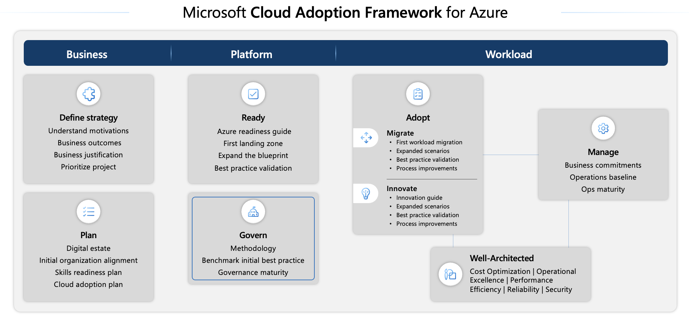

# AZ-104: Azure policies

## Table of contents
1. [Cloud Adoption Framework for Azure](#question1)
2. [Azure Policy](#question2)
3. [Azure Resource Manager](#question3)
4. [Azure Policy resources](#question4)
5. [Azure policy definition example](#question5)
6. [Evaluation of resources through Azure Policy](#question6)
7. [Azure RBAC](#question7)
8. [Self-service password reset](#question8)

## 1. Cloud Adoption Framework for Azure <a name="question1"></a>

Microsoft Cloud Adoption Framework for Azure offers comprehensive technical guidance for Microsoft Azure.  
Microsoft Azure Policy plays a significant role in the governance framework to help govern your cloud environment and workloads.  
Comprehensive cloud governance oversees all aspects of cloud use, minimizes various risks (such as compliance, security, resource management, and data-related concerns), and optimizes cloud operations throughout the organization. It ensures that cloud activities are consistent with the overall cloud strategy, facilitating the achievement of business objectives with reduced obstacles.  

  
**Steps for cloud governance (continuous process):**  
1. **Build a governance team** - Establish a dedicated cloud governance team that's responsible for defining, maintaining, and reporting on the progress of cloud governance policies.
2. **Assess cloud risks** - Conduct a thorough risk assessment that's unique to your organization, addressing all risk categories, including regulatory compliance, security, operations, costs, data management, resource management, and AI-related risks.
3. **Document cloud governance policies** - Clearly document cloud governance policies that dictate acceptable cloud usage and outline the rules and guidelines that mitigate identified risks.
4. **Enforce cloud governance policies** - Implement a systematic approach to ensure compliance with cloud governance policies. Use automated tools alongside manual oversight to enforce compliance. These tools help set guardrails, monitor configurations, and ensure adherence to policies.
5. **Monitor cloud governance** - Regularly monitor cloud usage and the governance teams to ensure ongoing compliance with the established cloud governance policies.

**Considerations for defining a cloud governance policy:**  
1. **Business risk** – You must document the evolving business risks and the business's tolerance for risk based on data classification and application criticality.
2. **Policy and compliance** – You must convert risk decisions into policy statements to establish cloud adoption boundaries efficiently.
3. **Process** – You must establish processes to monitor violations and adherence to corporate policies.

**Core disciplines of cloud governance:**  
1. **Cost management** – Evaluates and monitors costs, including controlling IT expenditures to establish well-defined cost management. It also includes adjusting resources according to demand. It's crucial to exercise control over cloud expenditure to derive greater value from your investments.
2. **Security baseline** – Ensures compliance with IT security requirements by applying a security baseline to all adoption efforts.
3. **Resource consistency** – Ensures consistency in resource configuration and enforcing practices for onboarding, recovery, and discoverability.
4. **Identity baseline** – Ensures that the baseline for identity and access is enforced by consistently applying role definitions and assignments.
5. **Deployment acceleration** – Accelerates the deployment of policies through centralization, consistency, and standardization across deployment templates.

## 2. Azure Policy <a name="question2"></a>

**Azure Policy** is a primary governance tool in MS Azure. **Azure Policy** facilitates the governance of all resources, including current and forthcoming resources. It helps to enforce organizational standards and to assess compliance at scale by establishing guardrails across various resources.  

**Governance actions:**  
- Ensure that your team deploys Azure resources only to allowed regions.
- Enforce geo-replication rules to comply with your data residency requirements.
- Allow only certain virtual machine sizes for your cloud environment.
- Enforce the consistent application of taxonomic tags across resources.
- Recommend system updates on your servers.
- Allow multifactor authentication for all subscription accounts.
- Require resources to send diagnostic logs to an Azure Monitor Logs workspace.

**Azure Policy** evaluates your resources and highlights resources that aren't compliant with the policies that you create. **Azure Policy** can also prevent noncompliant resources from being created. **Azure Policy** comes with built-in policy and initiative definitions for Storage, Networking, Compute, Security Center, and Monitoring.  
**Azure Policy** also integrates with **Azure DevOps** by applying any continuous integration and delivery pipeline policies that pertain to the predeployment and post-deployment phases of your applications.  
The objective when designing an **Azure Policy** should be to strike a balance between **control and stability** in one area with **speed and results** in the other.  
  
**Azure** provides four levels of **management** to establish proper governance:  
- **Management groups**  
    Azure **management groups** provide a way to efficiently manage access, policies, and compliance for subscriptions. You organize **subscriptions** into containers called **management groups** and then apply governance conditions to the **management groups**.  
    **Management groups** give you enterprise-grade management at a large scale, no matter what type of **subscriptions** you might have. **Management groups can be nested**.  
- **Subscriptions**  
    **Subscriptions** are a unit of management, billing, and scale. **Subscriptions** allow you to logically **organize** your **resource groups** and facilitate billing. Each **subscription** has limits or quotas on the number of **resources** that you can create and use. Organizations can use **subscriptions** to **manage costs** and the **resources** that users, teams, and projects create.  
    Using Azure requires an Azure **subscription**. An Azure **subscription** provides you with authenticated and authorized access to Azure products and services. It also allows you to provision resources. An Azure subscription links to an Azure account, which is an identity in **Microsoft Entra ID** or in a directory that **Microsoft Entra ID** trusts.  
- **Resource groups**  
    **Resource groups** are groupings of resources. While a **resource group** can contain **many resources**, a single **resource** can only be in **one resource group** at a time.  
    When you apply an action to a **resource group**, that action applies to **all resources** in the resource group.  
- **Resources**  
    A resource is the basic building block of Azure, and it includes instances of services that you create, provision, deploy, and so on. Virtual machines (VMs), virtual networks, databases, AI services, and so on, are considered resources in Azure.  

## 3. Azure Resource Manager <a name="question3"></a>

**Azure Resource Manager** is the deployment and management service for Azure. It provides a management layer that allows you to create, update, and delete resources in your Azure account.  

### Control plane

The **control plane** helps you **manage resources** in your subscription. **Azure Policy** operates in the control plane to enforce rules and compliance on your resources. **Azure Resource Manager** manages all control plane operations in Azure and includes the different components that are centralized between the different services. Azure Policy is integrated with Azure Resource Manager. **Azure Resource Manager** manages essential functions, such as template-based deployments, role-based access control (RBAC), auditing, monitoring, and tagging, which provides a unified management experience for Azure resources after deployment.  

### Data plane

**Data plane** allows you to access the capabilities provided by instances of specific resource types. The data plane is where the **actual data operations occur**, and Azure Policy ensures that the resources you interact with in the data plane are compliant with your policies. Data plane operations involve direct interaction with the data stored in a resource.  

Azure Policy allows individual Azure services to implement an **Azure Policy extension**, enhancing policy behavior and integration with specific resource providers. Azure Policy currently supports data plane operations through the following **resource provider modes**:  
- **Microsoft.Kubernetes.Data** - Used for managing Kubernetes clusters and components such as pods, containers, and ingresses.
- **Microsoft.KeyVault.Data** - Used for managing vaults and certificates in Azure Key Vault.
- **Microsoft.Network.Data** - Used for managing Microsoft Azure Virtual Network Manager custom membership policies by using Azure Policy.
- **Microsoft.ManagedHSM.Data** - Used for managing Azure Key Vault Managed HSM keys by using Azure Policy.
- **Microsoft.DataFactory.Data** - Used for using Azure Policy to deny Microsoft Azure Data Factory outbound traffic domain names.
- **Microsoft.MachineLearningServices.v2.Data** - Used for managing Microsoft Azure Machine Learning model deployments. This Resource Provider mode reports compliance for newly created and updated components.

### Operation flows of Azure Resource Manager

**Greenfield** refers to a scenario where an Azure Policy (`policy-first`) exists, and when you're creating or updating an Azure resource.  
**Brownfield** is the scenario where the resources exist already (`resource-first`), and you're assigning a new Azure Policy to those resources. Policy evaluation happens through a compliance scan, which runs automatically every 24 hours, or it can be manually triggered.  

## 4. Azure Policy resources <a name="question4"></a>

### Definitions

**Azure Policy definitions** describe resource compliance conditions and the effect to take if a condition is met. Several settings determine which resources are evaluated by any Azure Policy. The primary concept to which these settings can be applied is **scope**.  
**Scope** in Azure Policy is the **same** as the levels of **hierarchy for governance** in Azure. The definition might be saved in a management group or a subscription. The definition location determines the scope to which the initiative or policy can be assigned.  

### Initiatives

**Azure Policy initiatives**, also known as a **policy set**, allow you to **group several policy definitions** to simplify assignments and management because you work with the initiatives as a single item. **Initiatives** offer a streamlined and automated approach to governance, allowing organizations to manage and monitor compliance at scale. The **initiative definition contains all policy definitions** to help track your compliance state for a larger goal, such as organizational compliance goals or compliance with regulatory frameworks.  
  
- **Built-in** policy is a type of policy definition that's generated by Azure Resource Providers and is available **by default**. A group of such policy definitions is known as a **built-in initiative**.
- **Custom** policy is a type of policy definition that's written by a policy user when **no built-in policy maps to your requirements**. A group of such policy definitions is known as a **custom initiative**.

### Assignments

**Policy assignments** define **which resources are evaluated** by a policy definition or initiative.

### Exemptions

Use the **Policy exemptions** feature to **exempt a resource hierarchy or an individual resource from evaluation of initiatives or definitions**. Resources that are exempt count toward overall compliance but can't be evaluated or have a temporary waiver. They're created as a child object on the resource hierarchy, or the individual resource granted the exemption.  
**exemption categories:**  
- **Mitigated** - The exemption is granted because the policy intent is met through another method.
- **Waiver** - The exemption is granted because the noncompliance state of the resource is temporarily accepted.

### Attestations

**Policy attestations** are used by **Azure Policy** to set compliance states of resources or scopes targeted by **manual policies**. Each applicable resource requires one **attestation** for each **manual policy assignment**. For ease of management, **manual policies** should be designed to target the scope that defines the boundary of resources whose compliance state needs to be attested.

### Remediations

**The policy remediation** task feature is used to bring resources into compliance based on a definition and assignment. Resources that are noncompliant to a modify or `deployIfNotExists` definition assignment can be brought into compliance by using a **remediation** task. Resources that are newly created or updated that are applicable to a `deployIfNotExists` or modify definition assignment are automatically remediated.

## 5. Azure policy definition example <a name="question5"></a>

```JSON
{
  "displayName": "Allowed locations",
  "description": "This policy enables you to restrict the locations your organization can specify when deploying resources. Use to enforce your geo-compliance requirements. Excludes resource groups, Microsoft.AzureActiveDirectory/b2cDirectories, and resources that use the 'global' region.",
  "policyType": "BuiltIn",
  "mode": "Indexed",
  "metadata": {
    "version": "1.0.0",
    "category": "General"
  },
  "parameters": {
    "listOfAllowedLocations": {
      "type": "Array",
      "metadata": {
        "description": "The list of locations that can be specified when deploying resources.",
        "strongType": "location",
        "displayName": "Allowed locations"
      }
    }
  },
    "policyRule": {
      "if": {
        "allOf": [
          {
            "field": "location",
            "notIn": "[parameters('listOfAllowedLocations')]"
          },
          {
            "field": "location",
            "notEquals": "global"
          },
          {
            "field": "type",
            "notEquals": "Microsoft.AzureActiveDirectory/b2cDirectories"
          }
        ]
      },
      "then": {
        "effect": "deny"
      }
    }
  }
```

## 6. Evaluation of resources through Azure Policy <a name="question6"></a>

1. **Evaluation triggers:**
    - a policy or initiative is newly assigned to a scope
    - a policy or initiative already assigned to a scope is updated
    - a resource is deployed to or updated in a scope with an assignment through Azure Resource Manager, REST API, or a supported SDK
    - a subscription (resource type Microsoft.Resources/subscriptions) is created or moved in a management group hierarchy with an assigned policy definition that targets the subscription resource type
    - a policy exemption is created, updated, or deleted
    - standard compliance evaluation cycle
    - the machine configuration resource provider is updated with compliance details by a managed resource
    - on-demand scan

2. **Evaluation timing:**  
    **Compliance scans triggers:**  
    - **Automatic full scan** - A full compliance scan is triggered automatically every 24 hours.
    - **Manual scan for Brownfield scenarios** - In cases where a new policy is applied to existing resources (Brownfield scenarios), you can manually trigger a compliance scan by running az policy state trigger-scan.

    When you assign a new policy, a delay can occur in the policy taking effect, which can be up to 30 minutes. To bypass the caching delay, you can sign out and sign back in to refresh the Azure Resource Manager cache, which ensures that the new policy is applied immediately to the defined scope.  

    **Timing factors:**  
    - **Policy definitions** - The size and complexity of the policy definitions can increase scan time.
    - **Number of policies** - The more policies applied, the longer the scan might take.
    - **Scope size** - The size of the resource scope assigned to the policy also plays a role.
    - **System load** - Compliance scans are a low-priority operation, meaning that if the system is busy with more critical tasks, the scan might take longer. The system prioritizes interactive and high-importance operations, so scans might take several minutes, or tens of minutes, even in smaller environments.
    - **Synchronous scan (Low-Priority Execution)** - Because compliance scans are synchronous and assigned a low priority in Azure's system, they're delayed if the system is busy. This scan can significantly extend the time it takes for the scan to complete, even for smaller scopes or policies.

3. **Resource compliance states:**
    - Non-compliant
    - Compliant
    - Error (for template or evaluation error)
    - Conflicting (two or more policy assignments in the same scope with contradicting rules, such as two policies appending the same tag with different values)
    - Protected (resource covered under an assignment with a denyAction effect)
    - Exempted Unknown (default state for definitions with a manual effect)

3. **Enforcement Mode:**  
    `enforcementMode` is a property of a policy assignment that lets you deactivate the enforcement of certain policy effects. This mode allows you to **test the policy's outcome** on existing resources without initiating the policy effect or triggering entries in the Azure Activity log. The `enforcementMode` can be changed to `Enabled` after the policy is thoroughly tested.  
    **Remediation tasks** can be **started** for `deployIfNotExists` policies, even when `enforcementMode` is set to `DoNotEnforce`.  
    The **best practices** framework focuses on **minimizing the impact of policy changes** while ensuring compliance, and it includes two aspects:  
    - **First aspect** - Start from Assignments of new policies with `enforcementMode` `Disabled`. When assigning policies that include deny or modify actions, beginning with enforcementMode Disabled allows you to view the compliance state and evaluate policy outcomes without triggering actions or denying operations. This `what-if` scenario **minimizes impact** and helps **identify issues** in the new policies or changes **without disrupting the environment**.
    - **Second aspect** - Deploy policies in deployment rings. To control potential negative impacts, **policies should be deployed gradually in smaller subsets and then in bigger sets**. You can start with test and development environments and then move to production by applying the policy to a small subset first. This strategy helps in testing the policy thoroughly. Gradually expanding the scope (through deployment rings) can cover the full production environment.

4. How to apply the safe deployment best practices framework for Azure Policy assignments:  
    1. **Create definition** - Begin by defining the policy definition with the scope as root (tenant).
    2. **Create assignment** - Define deployment rings (1 to 5) by using resource selectors. Assign the policy to a specific scope (such as a resource group, subscription, or management group) in Ring 5. Assign with enforcementMode Disabled to evaluate compliance without enforcing changes.  
        - **Compliance check** - Verify that the policy is being applied correctly and that the desired compliance state is achieved for the resources in Ring 5.
        - **Application health check** - Assess the impact of the policy for the resources in Ring 5. Ensure that no unexpected side effects exist.
    3. **Repeat for each ring (Non-production)** - Repeat step 3 for all nonproduction environment rings.
    4. **Update assignment (Optional)** - If necessary, adjust the policy definition or assignment based on the evaluation of resources of the nonproduction environment and then reassign it to the resources in Ring 5 with the enforcementMode Enabled.
        - **Compliance check** - Reevaluate compliance after making changes (same as step 3a).
        - **Application health check** - Again, verify that the policy isn't causing issues (same as step 3b).
    5. **Repeat for each ring (Non-production)** - Repeat step 6 for all nonproduction environment rings.
    6. **Repeat for production rings** - After the policy is validated in a nonproduction environment, gradually deploy it to production environments, starting with a smaller subset (ring) and expanding the scope over time.

Azure Policy events allow applications to react to state changes. This integration is done without the need for complicated code or expensive and inefficient polling services. **Events from Azure Policy** (Event Source) are pushed through Microsoft **Azure Event Grid** to **Event Handlers**.

## 7. Azure RBAC <a name="question7"></a>

**Azure role-based access control (RBAC)** is an **authorization system** built on Azure Resource Manager that provides fine-grained access management for resources in Azure.  
You can grant access by assigning the appropriate Azure role to users, groups, and applications at a certain scope. The scope of a role assignment can be at any level. A role assigned at a parent scope also grants access to the child scopes contained within it.  
**Azure RBAC** in the Azure portal can be configured in **Access control (IAM)**, also known as **identity and access management**.  
To create a role assignment, you need three elements: a security principal, a role definition, and a scope.  
- **Security principal** (who): a user, group, or application to which you want to grant access
- **Role definition** (what): a collection of permissions (`read`, `write`, `delete`)  
    Built-in roles:  
    - **Owner**: Has full access to all resources, including the right to delegate access to others.
    - **Contributor**: Can create and manage all types of Azure resources, but can’t grant access to others.
    - **Reader**: Can view existing Azure resources.
    - **User Access Administrator**: Lets you manage user access to Azure resources.
- **Scope** (where): level where the access applies

A **role assignment** is the process of binding a role to a security principal at a particular scope for the purpose of granting access. To grant access, you'll create a role assignment. To revoke access, you'll remove a role assignment.  
**Azure RBAC** is an allow model.  
**Azure RBAC** has something called `NotActions` permissions. You can use `NotActions` to create a set of **not allowed permissions**. The access a role grants—the effective permissions—is computed by **subtracting** the `NotActions` operations from the `Actions` operations.  

## 8. Self-service password reset <a name="question8"></a>

**Self-service password reset (SSPR)** reduces the load on administrators and minimizes the productivity impact of a forgotten or expired password. With SSPR, users can reset their passwords in a web browser or from a Windows sign-in screen to regain access to Azure, Microsoft 365, and any other application that uses Microsoft Entra ID for authentication.  
  
The **reset portal** takes these steps:
1. **Localization**: The portal checks the browser's locale setting and renders the SSPR page in the appropriate language.
2. **Verification**: The user enters their username and passes a CAPTCHA to ensure that it's a user and not a bot.
3. **Authentication**: The user enters the required data to authenticate their identity. They might enter a code or answer security questions.
4. **Password reset**: If the user passes the authentication tests, they can enter a new password and confirm it.
5. **Notification**: A message is sent to the user to confirm the reset.

### Authenticate a password reset (minimum: 1 or 2)
1. Mobile app notification (Microsoft Authenticator app)
2. Mobile app code (Microsoft Authenticator app)
3. Email
4. Mobile phone
5. Office phone
6. Security questions

> In trial Microsoft Entra organizations, phone call options aren't supported.

### Accounts associated with administrator roles

1. A strong, two-method authentication policy is always applied to accounts with an administrator role, regardless of your configuration for other users.
2. The **security-question** method **isn't available** to accounts associated with an administrator role.

License requirements: Microsoft Entra ID, Premium P1 and Premium P2. Writeback support is available in Microsoft Entra ID P1 or P2. It's also available with Microsoft 365 Apps for business.  
