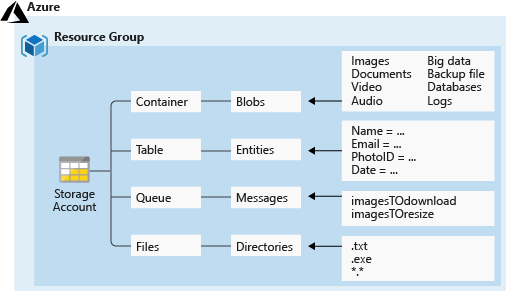

# Azure Storage

## Table of contents
1. [Azure Storage](#question1)
2. [Azure Storage services](#question2)
3. [Storage account types](#question3)
4. [Replication strategies](#question4)
5. [Access storage](#question5)
6. [Azure Blob Storage](#question6)
7. [Azure Files](#question7)
8. [Some](#question8)
9. [Some](#question9)
10. [Some](#question10)

## 1. Azure Storage 

$\color{Green}\large{\textsf{Azure Storage}}$ is Microsoft's cloud storage solution for modern data storage scenarios. Azure Storage offers a massively scalable object store for data objects. It provides a file system service for the cloud, a messaging store for reliable messaging, and a NoSQL store.

Azure Storage is an AI-ready service that you can use to $\color{Yellow}\large{\textsf{store files, messages, tables, and other types of information}}$. You use Azure Storage for applications like file shares. Developers use Azure Storage for working data. Working data includes $\color{Yellow}\large{\textsf{websites, mobile apps, and desktop applications}}$. Azure Storage is also used by IaaS virtual machines, and PaaS cloud services.

| Category | Description | Storage examples |
|-----|-----|-----|
| Virtual machine data | Virtual machine data storage includes disks and files. Disks are persistent block storage for Azure IaaS virtual machines. Files are fully managed file shares in the cloud. | Storage for virtual machine data is provided through $\color{Green}\large{\textsf{Azure managed disks}}$. Data disks are used by virtual machines to store data like database files, website static content, or custom application code. The number of data disks you can add depends on the virtual machine size. |
| Unstructured data | Unstructured data is the least organized. The format of unstructured data is referred to as nonrelational. | Unstructured data can be stored by using $\color{Green}\large{\textsf{Azure Blob Storage and Azure Data Lake Storage}}$. Blob Storage is a highly scalable, REST-based cloud object store. Azure Data Lake Storage is the Hadoop Distributed File System (HDFS) as a service |
| Structured data | Structured data is stored in a relational format that has a shared schema. Structured data is often contained in a database table with rows, columns, and keys. Tables are an autoscaling NoSQL store. | Structured data can be stored by using $\color{Green}\large{\textsf{Azure Table Storage, Azure Cosmos DB, and Azure SQL Database}}$. Azure Cosmos DB is a globally distributed database service. Azure SQL Database is a fully managed database-as-a-service built on SQL |

### Things to consider when using Azure Storage

- $\color{Green}\large{\textsf{Durability and availability}}$  
    Azure Storage is durable and highly available. Redundancy ensures your data is safe during transient hardware failures. You replicate data across datacenters or geographical regions for protection from local catastrophe or natural disaster. Replicated data remains highly available during an unexpected outage.
- $\color{Green}\large{\textsf{Secure access}}$  
    Azure Storage encrypts all data. Azure Storage provides you with fine-grained control over who has access to your data.
- $\color{Green}\large{\textsf{Scalability}}$  
    Azure Storage is designed to be massively scalable to meet the data storage and performance needs of modern applications.
- $\color{Green}\large{\textsf{Manageability}}$  
    Microsoft Azure handles hardware maintenance, updates, and critical issues for you.
- $\color{Green}\large{\textsf{Data accessibility}}$  
    Data in Azure Storage is accessible from anywhere in the world over HTTP or HTTPS. Microsoft provides SDKs for Azure Storage in various languages. You can use .NET, Java, Node.js, Python, PHP, Ruby, Go, and the REST API. Azure Storage supports scripting in Azure PowerShell or the Azure CLI. The Azure portal and Azure Storage Explorer offer easy visual solutions for working with your data.

## 2. Azure Storage services 

1. Azure Blob Storage:  
    Blob Storage is optimized for storing massive amounts of unstructured or nonrelational data, such as text or binary data. Blob Storage is ideal for:  
    - Serving images or documents directly to a browser.
    - Storing files for distributed access.
    - Streaming video and audio.
    - Storing data for backup and restore, disaster recovery, and archiving.
    - Storing data for analysis by an on-premises or Azure-hosted service.
2. Azure Files:  
    Azure Files enables you to set up highly available network file shares. Shares can be accessed by using the Server Message Block (SMB) protocol and the Network File System (NFS) protocol. Multiple virtual machines can share the same files with both read and write access. You can also read the files by using the REST interface or the storage client libraries.  
    Scenarios:  
    - Many on-premises applications use file shares. This feature makes it easier to migrate those applications that share data to Azure. If you mount the file share to the same drive letter that the on-premises application uses, the part of your application that accesses the file share should work with minimal, if any, changes.
    - Configuration files can be stored on a file share and accessed from multiple virtual machines. Tools and utilities used by multiple developers in a group can be stored on a file share, ensuring that everybody can find them, and that they use the same version.
    - Diagnostic logs, metrics, and crash dumps are just three examples of data that can be written to a file share and processed or analyzed later.

    > The storage account credentials are used to provide authentication for access to the file share. All users who have the share mounted should have full read/write access to the share.
3. Azure Queue Storage:  
    Azure Queue Storage is used to store and retrieve messages. Queue messages can be up to 64 KB in size, and a queue can contain millions of messages. Queues are used to store lists of messages to be processed asynchronously.  
    Consider a scenario where you want your customers to be able to upload pictures, and you want to create thumbnails for each picture. You could have your customer wait for you to create the thumbnails while uploading the pictures. An alternative is to use a queue. When the customer finishes the upload, you can write a message to the queue. Then you can use an Azure Function to retrieve the message from the queue and create the thumbnails. Each of the processing parts can be scaled separately, which gives you more control when tuning the configuration.  
4. Azure Table Storage:  
    Azure Table storage is a service that stores nonrelational structured data (also known as structured NoSQL data) in the cloud, providing a key/attribute store with a schemaless design. Because Table storage is schemaless, it's easy to adapt your data as the needs of your application evolve. Access to Table storage data is fast and cost-effective for many types of applications, and is typically lower in cost than traditional SQL for similar volumes of data. In addition to the existing Azure Table Storage service, there's a new Azure Cosmos DB Table API offering that provides throughput-optimized tables, global distribution, and automatic secondary indexes.  

### Things to consider when choosing Azure Storage services

- $\color{Green}\large{\textsf{Optimization for massive data}}$. Azure Blob Storage is optimized for storing massive amounts of unstructured data. Objects in Blob Storage can be accessed from anywhere in the world via HTTP or HTTPS. Blob Storage is ideal for serving data directly to a browser, streaming data, and storing data for backup and restore.
- $\color{Green}\large{\textsf{Storage with high availability}}$. Azure Files supports highly available network file shares. On-premises apps use file shares for easy migration. By using Azure Files, all users can access shared data and tools. Storage account credentials provide file share authentication to ensure all users who have the file share mounted have the correct read/write access.
- $\color{Green}\large{\textsf{Storage for messages}}$. Use Azure Queue Storage to store large numbers of messages. Queue Storage is commonly used to create a backlog of work to process asynchronously.
- $\color{Green}\large{\textsf{Storage for structured data}}$. Azure Table Storage is ideal for storing structured, nonrelational data. It provides throughput-optimized tables, global distribution, and automatic secondary indexes. Because Azure Table Storage is part of Azure Cosmos DB, you have access to a fully managed NoSQL database service for modern app development.

## 3. Storage account types 

$\color{Green}\large{\textsf{Standard storage accounts}}$ are backed by magnetic $\color{Green}\large{\textsf{hard disk drives (HDD)}}$. A standard storage account provides the lowest cost per GB. You can use Standard storage for applications that require bulk storage or where data is infrequently accessed.

$\color{Green}\large{\textsf{Premium storage accounts}}$ are backed by $\color{Green}\large{\textsf{solid-state drives (SSD)}}$ and offer consistent low-latency performance. You can use Premium storage for Azure virtual machine disks with I/O-intensive applications like databases.

> You can't convert a Standard storage account to a Premium storage account or vice versa. You must create a new storage account with the desired type and copy data, if applicable, to a new storage account. All storage account types are encrypted by using Storage Service Encryption (SSE) for data at rest.

| Storage account | Supported services | Recommended usage |
|----|----|----|
| Standard general-purpose v2 | Blob Storage (including Data Lake Storage), Queue Storage, Table Storage, and Azure Files | Standard storage account for most scenarios, including blobs, file shares, queues, tables, and disks (page blobs) |
| Premium block blobs | Blob Storage (including Data Lake Storage) | Premium storage account for block blobs and append blobs. Recommended for applications with high transaction rates. Use Premium block blobs if you work with smaller objects or require consistently low storage latency. This storage is designed to scale with your applications |
| Premium file shares | Azure Files | Premium storage account for file shares only. Recommended for enterprise or high-performance scale applications. Use Premium file shares if you require support for both Server Message Block (SMB) and NFS file shares |
| Premium page blobs | Page blobs only | Premium high-performance storage account for page blobs only. Page blobs are ideal for storing index-based and sparse data structures, such as operating systems, data disks for virtual machines, and databases |

## 4. Replication strategies 

The data in your Azure storage account is $\color{Green}\large{\textsf{always replicated}}$ to ensure durability and high availability. Azure Storage replication copies your data to protect from planned and unplanned events.

1. $\color{Green}\large{\textsf{Locally redundant storage}}$:  
    Locally redundant storage is the $\color{Green}\large{\textsf{lowest-cost replication option}}$ and offers the least durability compared to other strategies. If a data center-level disaster occurs, such as fire or flooding, all $\color{Green}\large{\textsf{replicas might be lost or unrecoverable}}$. Despite its limitations, LRS can be appropriate in several scenarios:   
    - Your application stores data that can be easily reconstructed if data loss occurs.
    - Your data is constantly changing like in a live feed, and storing the data isn't essential.
    - Your application is restricted to replicating data only within a location due to data governance requirements.
2. $\color{Green}\large{\textsf{Zone redundant storage}}$:  
    Zone redundant storage synchronously replicates your data across $\color{Green}\large{\textsf{three storage clusters in a single region}}$. Each storage cluster is physically separated from the others and resides in its $\color{Green}\large{\textsf{own availability zone}}$. Each availability zone, and the ZRS cluster within it, is autonomous, and has separate utilities and networking capabilities. Storing your data in a ZRS account ensures you can access and manage your data if a zone becomes unavailable. ZRS provides excellent performance and low latency.  
    - ZRS isn't currently available in all regions.
    - Changing to ZRS from another data replication option requires the physical data movement from a single storage stamp to multiple stamps within a region.
3. $\color{Green}\large{\textsf{Geo-redundant storage}}$:  
    Geo-redundant storage replicates your data to a secondary region. GRS provides a higher level of durability even during a regional outage. GRS is designed to provide at least 99.99999999999999% (16 9's) durability.  
    - $\color{Green}\large{\textsf{GRS}}$ replicates your data to another data center in a secondary region. $\color{Yellow}\large{\textsf{The data is available to be read only}}$ $\color{Yellow}\large{\textsf{if Microsoft initiates a failover from the primary to secondary region}}$
    - $\color{Green}\large{\textsf{Read-access geo-redundant storage (RA-GRS)}}$ is based on GRS. RA-GRS replicates your data to another data center in a secondary region, and also provides you with the option to $\color{Yellow}\large{\textsf{read from the secondary region}}$

    > ll data is first replicated with locally redundant storage. An update is first committed to the primary location and replicated by using LRS. The update is then replicated asynchronously to the secondary region by using GRS. Data in the secondary region uses LRS.

    > Both the primary and secondary regions manage replicas across separate fault domains and upgrade domains within a storage scale unit. The storage scale unit is the basic replication unit within the datacenter. Replication at this level is provided by LRS.

4. $\color{Green}\large{\textsf{Geo-zone redundant storage}}$:  
    Data in a GZRS storage account is replicated across three Azure availability zones in the primary region, and also replicated to a secondary geographic region for protection from regional disasters. Each Azure region is paired with another region within the same geography, together making a regional pair. GZRS is designed to provide at least 99.99999999999999% (16 9's) durability of objects over a given year. GZRS also offers the same scalability targets as LRS, ZRS, GRS, or RA-GRS. You can optionally enable read access to data in the secondary region with read-access geo-zone-redundant storage (RA-GZRS).

## 5. Access storage 

| Service | Default endpoint |
|-----|-----|
| Container service | `//mystorageaccount.blob.core.windows.net/mycontainer/myblob` |
| Table service | `//mystorageaccount.table.core.windows.net/<...>` |
| Queue service | `//mystorageaccount.queue.core.windows.net/<...>` |
| File service | `//mystorageaccount.file.core.windows.net/<...>` |

If you map a custom domain and subdomain, such as `www.contoso.com`, to the blob or web endpoint for your storage account, your users can use that domain to access blob data in your storage account. Direct mapping lets you enable a custom domain for a subdomain to an Azure storage account. For this approach, you create a `CNAME` record that points from the subdomain to the Azure storage account.  
The following example shows how a subdomain is mapped to an Azure storage account to create a CNAME record in the domain name system (DNS):  
- Subdomain: `blobs.contoso.com`
- Azure storage account: `\<storage account>\.blob.core.windows.net`
- Direct `CNAME` record: `contosoblobs.blob.core.windows.net`

### Secure storage endpoints

To access these settings for your storage account, you use the $\color{Green}\large{\textsf{Firewalls and virtual networks settings}}$. You add the virtual networks that should have access to the service for the account. This setting restricts access to your storage account from specific subnets on virtual networks or public IPs.  
- You can configure the service to allow access to one or more public IP ranges.
- Subnets and virtual networks must exist in the $\color{Yellow}\large{\textsf{same Azure region or region pair}}$ as your storage account

## 6. Azure Blob Storage 

Azure Blob Storage is a service that stores unstructured data in the cloud as objects or blobs. Blob stands for Binary Large Object. Blob Storage is also referred to as object storage or container storage.

- Blob Storage can store any type of $\color{Green}\large{\textsf{text or binary data}}$. Some examples are text documents, images, video files, and application installers.
- Blob Storage uses three resources to store and manage your data:  
    - An Azure storage account
    - Containers in an Azure storage account
    - Blobs in a container
- To implement Blob Storage, you configure several settings:  
    - Blob container options.
    - Blob types and upload options.
    - Blob Storage access tiers.
    - Blob lifecycle rules.
    - Blob object replication options.

### Azure Blob Storage Usage

- $\color{Green}\large{\textsf{Browser uploads}}$. Use Blob Storage to serve images or documents directly to a browser.
- $\color{Green}\large{\textsf{Distributed access}}$. Blob Storage can store files for distributed access, such as during an installation process.
- $\color{Green}\large{\textsf{Streaming data}}$. Stream video and audio by using Blob Storage.
- $\color{Green}\large{\textsf{Archiving and recovery}}$. Blob Storage is a great solution for storing data for backup and restore, disaster recovery, and archiving.
- $\color{Green}\large{\textsf{Application access}}$. You can store data in Blob Storage for analysis by an on-premises or Azure-hosted service.

Azure Blob Storage uses a container resource to group a set of blobs. A blob can't exist by itself in Blob Storage. A $\color{Green}\large{\textsf{blob must be stored in a container resource}}$.  
> A container can store an unlimited number of blobs

> An Azure storage account can contain an unlimited number of containers

> You must create a storage container $\color{Green}\large{\textsf{before}}$ you can begin to upload data

By default, $\color{Green}\large{\textsf{container data is private and visible only to the account owner}}$. There are three access level choices:  
- Private: (Default) Prohibit anonymous access to the container and blobs.
- Blob: Allow anonymous public read access for the blobs only.
- Container: Allow anonymous public read and list access to the entire container, including the blobs.

### Blob access tiers

1. $\color{Green}\large{\textsf{Hot tier}}$:  
    The Hot tier is optimized for $\color{Green}\large{\textsf{frequent reads and writes of objects}}$ in the Azure storage account. A good usage case is data that is actively being processed. An online tier optimized for storing data that is accessed or modified frequently. The hot tier has the $\color{Green}\large{\textsf{highest storage costs, but the lowest access costs}}$.
2. $\color{Green}\large{\textsf{Cool tier}}$:  
    The Cool tier is optimized for storing $\color{Green}\large{\textsf{large amounts of infrequently accessed data}}$. This tier is intended for data that remains in the Cool tier for at least $\color{Green}\large{\textsf{30 days}}$. A usage case for the Cool tier is $\color{Green}\large{\textsf{short-term backup and disaster recovery datasets and older media content}}$. This content shouldn't be viewed frequently, but it needs to be immediately available. Storing data in the Cool tier is more cost-effective. The cool tier has lower storage costs and higher access costs compared to the hot tier.
3. $\color{Green}\large{\textsf{Cold tier}}$:  
    The Cold tier is also optimized for storing $\color{Green}\large{\textsf{large amounts of infrequently accessed data}}$. This tier is intended for data that can remain in the tier for at least $\color{Green}\large{\textsf{90 days}}$. The cold tier has lower storage costs and higher access costs compared to the cool tier.
4. $\color{Green}\large{\textsf{Archive tier}}$:  
    The Archive tier is an $\color{Green}\large{\textsf{offline tier that's optimized for data that can tolerate several hours of retrieval latency}}$. Data must remain in the Archive tier for at least $\color{Green}\large{\textsf{180 days}}$ or be subject to an early deletion charge. Data for the Archive tier includes $\color{Green}\large{\textsf{secondary backups, original raw data, and legally required compliance information}}$. This tier is the $\color{Green}\large{\textsf{most cost-effective option for storing data}}$. Accessing data is more expensive in the Archive tier than accessing data in the other tiers.  
    An archive tier $\color{Yellow}\large{\textsf{doesn't allow you to read or modify the content of a blob directly}}$. However, you do have access to its metadata, including index tags. $\color{Yellow}\large{\textsf{To access the blob's content, you can assign it to the hot, cool, or cold tier}}$ $\color{Yellow}\large{\textsf{to trigger the process referred to as rehydration}}$.

| Comparison | Hot access tier | Cool access tier | Cold access tier | Archive access tier |
|-----|-----|-----|-----|-----|
| Availability | 99.9% | 99% | 99% | 99% |
| Availability (RA-GRS reads) | 99.99% | 99.9% | 99.9% | 99.9% |
| Latency (time to first byte) | milliseconds | milliseconds | milliseconds | hours |
| Minimum storage duration | N/A | 30 days | 90 days | 180 days |

### Blob lifecycle management rules

Azure Blob Storage supports lifecycle management for data sets. It offers a rich rule-based policy for GPv2 and Blob Storage accounts. You can use lifecycle policy rules to transition your data to the appropriate access tiers, and set expiration times for the end of a data set's lifecycle.  
- Transition blobs to a cooler storage tier (Hot to Cool, Hot to Archive, Cool to Archive) to optimize for performance and cost.
- Delete current versions of a blob, previous versions of a blob, or blob snapshots at the end of their lifecycles.
- Apply rules to an entire storage account, to select containers, or to a subset of blobs using name prefixes or blob index tags as filters.

> For each rule, you create `If (More than <days ago> )- Then (Move to <type> storage)`block conditions to transition or expire data based on your specifications. As you review these details, consider how you can set up lifecycle management policy rules for your data sets.

### Blob object replication

Object replication copies blobs in a container $\color{Green}\large{\textsf{asynchronously}}$ according to policy rules that you configure. Replication includes the blob content, metadata properties, and versions.  

- Object replication $\color{Yellow}\large{\textsf{requires that blob versioning is enabled on both the source and destination accounts}}$. When blob versioning is enabled, you can access earlier versions of a blob. This access lets you recover your modified or deleted data.
- Object replication $\color{Yellow}\large{\textsf{doesn't support blob snapshots}}$. Any snapshots on a blob in the source account aren't replicated to the destination account.
- Object replication $\color{Yellow}\large{\textsf{is supported}}$ when the source and destination accounts are in the $\color{Yellow}\large{\textsf{Hot, Cool, or Cold tier}}$. The source and destination accounts can be in different tiers.
- When you configure object replication, you create a replication policy that specifies the source Azure storage account and the destination storage account.
- A replication policy includes one or more rules that specify a source container and a destination container. The policy identifies the blobs in the source container to replicate.

Benefits:  
- $\color{Green}\large{\textsf{Latency reductions}}$. Minimize latency with blob object replication. You can reduce latency for read requests by enabling clients to consume data from a region that's in closer physical proximity.
- $\color{Green}\large{\textsf{Efficiency for compute workloads}}$. Improve efficiency for compute workloads by using blob object replication. With object replication, compute workloads can process the same sets of blobs in different regions.
- $\color{Green}\large{\textsf{Data distribution}}$. Optimize your configuration for data distribution. You can process or analyze data in a single location and then replicate only the results to other regions.
- $\color{Green}\large{\textsf{Costs benefits}}$. Manage your configuration and optimize your storage policies. After your data is replicated, you can reduce costs by moving the data to the Archive tier by using lifecycle management policies.

### Blob Types

- $\color{Green}\large{\textsf{Block blobs}}$. A block blob consists of blocks of data that are assembled to make a blob. Most Blob Storage scenarios use block blobs. Block blobs are ideal for storing text and binary data in the cloud, like files, images, and videos. The block blob type is the default type for a new blob. When you're creating a new blob, if you don't choose a specific type, the new blob is created as a block blob.
- $\color{Green}\large{\textsf{Append blobs}}$. An append blob is similar to a block blob because the append blob also consists of blocks of data. The $\color{Green}\large{\textsf{blocks of data are optimized for append operations}}$. Append blobs are useful for $\color{Green}\large{\textsf{logging scenarios}}$, where the amount of data can increase as the logging operation continues.
- $\color{Green}\large{\textsf{Page blobs}}$. A page blob can be up to $\color{Green}\large{\textsf{8 TB}}$ in size. Page blobs are more $\color{Green}\large{\textsf{efficient for frequent read/write operations}}$. Azure Virtual Machines uses page blobs for operating system disks and data disks.

> After you create a blob, you can't change its type.

To upload blobs you can use Azure Portal (few files), Azure Storage Explorer (largere numbers of files), AzCopy (command line tool), Azure Data Box Disk (transfer on-premise data to Blob Storage -> request SSD from MS, copy data to disk, ship it back to MS to be uploaded to Blob Storage)

### Blob Storage pricing

- Volume of data stored per month.
- Quantity and types of operations performed, along with any data transfer costs.
- Data redundancy option selected.

You can use the Azure Pricing Calculator to estimate your storage costs.

- Performance tiers. The Blob Storage tier determines the amount of data stored and the cost for storing that data. As the performance tier gets cooler, the per-gigabyte cost decreases.
- Data access costs. Data access charges increase as the tier gets cooler. For data in the Cool and Archive tiers, you're billed a per-gigabyte data access charge for reads.
- Transaction costs. There's a per-transaction charge for all tiers. The charge increases as the tier gets cooler.
- Geo-replication data transfer costs. This charge only applies to accounts that have geo-replication configured, including GRS and RA-GRS. Geo-replication data transfer incurs a per-gigabyte charge.
- Outbound data transfer costs. Outbound data transfers incur billing for bandwidth usage on a per-gigabyte basis. This billing is consistent with general-purpose Azure storage accounts.
- Changes to the storage tier. If you change the account storage tier from Cool to Hot, you incur a charge equal to reading all the data existing in the storage account. Changing the account storage tier from Hot to Cool incurs a charge equal to writing all the data into the Cool tier (GPv2 accounts only).

## 7. Azure Files 

Azure Files offers $\color{Green}\large{\textsf{fully managed file shares in the cloud}}$. You can access Azure file shares by using the Server Message Block (SMB), Network File System (NFS), and HTTP protocols. Clients can connect to Azure file shares from Windows, Linux, and macOS devices.

Characteristics:

- $\color{Green}\large{\textsf{Serverless deployment}}$. An Azure file share is a `PaaS` offering of a fully managed file share that doesn't require any infrastructure. You don't need to take care of any VMs, operating systems, or updates.
- $\color{Green}\large{\textsf{Almost unlimited storage}}$. A single Azure file share can store up to $\color{Green}\large{\textsf{100 tebibytes (TiB) of files}}$, and a $\color{Green}\large{\textsf{file can be up to 4 TiB in size}}$. The files are organized in a hierarchical folder structure in the same way as on on-premises file servers.
- $\color{Green}\large{\textsf{Data encryption}}$. The data on an Azure file share is encrypted at rest in an Azure datacenter and in transit on a network.
- $\color{Green}\large{\textsf{Access from anywhere}}$. By default, clients can access Azure file shares from anywhere if they have internet connectivity.
- $\color{Green}\large{\textsf{Integration into an existing environment}}$. You can control access to Azure file shares by using Microsoft Entra identities or AD DS identities that are synced to Microsoft Entra ID. This helps ensure that users can have the same experience accessing an Azure file share as when they access an on-premises file server.
- $\color{Green}\large{\textsf{Previous versions and backups}}$. You can create Azure file share snapshots that integrate with the Previous Versions feature in File Explorer. You can also use Azure Backup to back up Azure file shares.
- $\color{Green}\large{\textsf{Data redundancy}}$. Azure file share data replicates to multiple locations in the same Azure datacenter or across many Azure datacenters. The replication setting of the Azure storage account that includes the file share controls the data redundancy.

Features:

- $\color{Green}\large{\textsf{Replacement and supplement options}}$. Replace or supplement traditional on-premises file servers or NAS devices by using Azure Files.
- $\color{Green}\large{\textsf{Global access}}$. Directly access Azure file shares by using most operating systems, such as Windows, macOS, and Linux, from anywhere in the world.
- $\color{Green}\large{\textsf{Lift and shift support}}$. Lift and shift applications to the cloud with Azure Files for apps that expect a file share to store file application or user data
- $\color{Green}\large{\textsf{Using Azure File Sync}}$. Replicate Azure file shares to Windows Servers by using Azure File Sync. You can replicate on-premises or in the cloud for performance and distributed caching of the data where it's being used.
- $\color{Green}\large{\textsf{Shared applications}}$. Store shared application settings such as configuration files in Azure Files.
- $\color{Green}\large{\textsf{Diagnostic data}}$. Use Azure Files to store diagnostic data such as logs, metrics, and crash dumps in a shared location.
- $\color{Green}\large{\textsf{Tools and utilities}}$. Azure Files is a good option for storing tools and utilities that are needed for developing or administering Azure VMs or cloud services.

### Compare Azure Files to Azure Blob Storage

| Azure Files (file shares) | Azure Blob Storage (blobs) |
|----|----|
| Provides the SMB and NFS protocols, client libraries, and a REST interface that allows access from anywhere to stored files. | Provides client libraries and a REST interface that allows unstructured data to be stored and accessed at a massive scale in block blobs. |
| - Files in an Azure Files share are true directory objects. - Data in Azure Files is accessed through file shares across multiple virtual machines. | - Blobs in Azure Blob Storage are a flat namespace. - Blob data in Azure Blob Storage is accessed through a container. |
| Azure Files is ideal to lift and shift an application to the cloud that already uses the native file system APIs. Share data between the app and other applications running in Azure. Azure Files is a good option when you want to store development and debugging tools that need to be accessed from many virtual machines. | Azure Blob Storage is ideal for applications that need to support streaming and random-access scenarios. Azure Blob Storage is a good option when you want to be able to access application data from anywhere. |

## 8.  

## 9.  

## 10.  